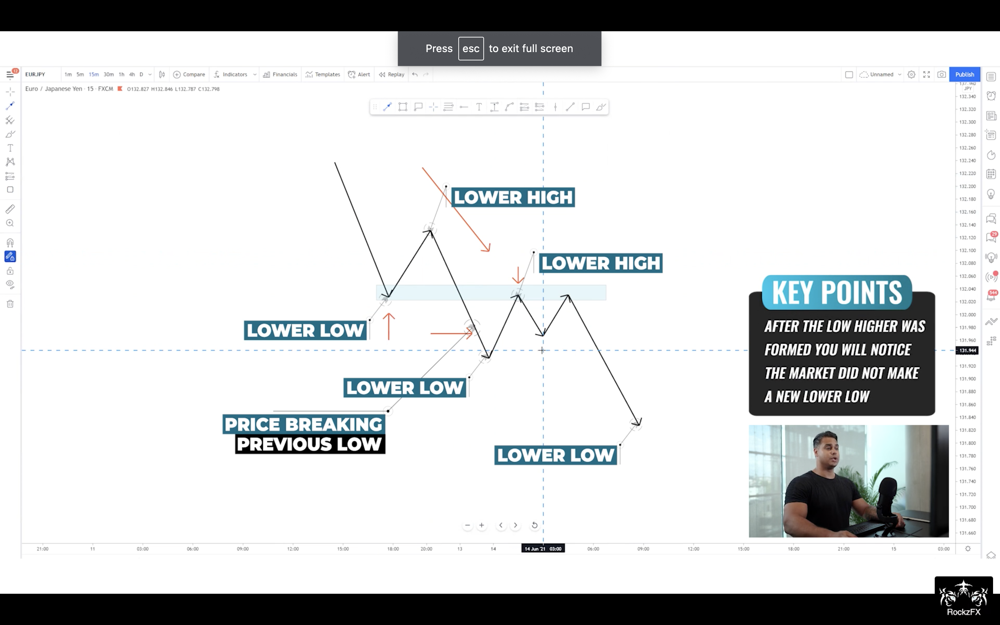
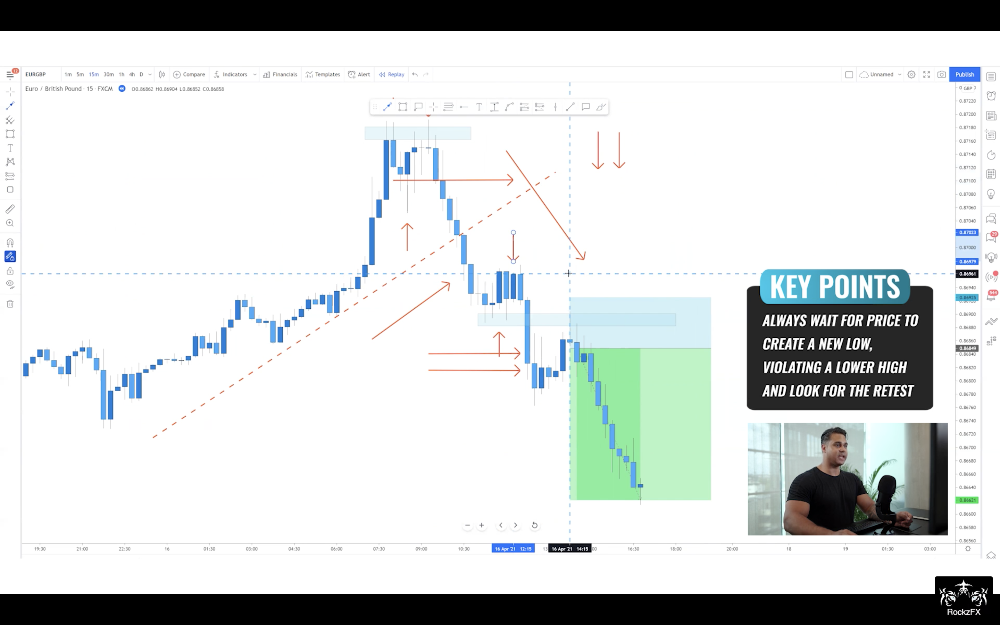
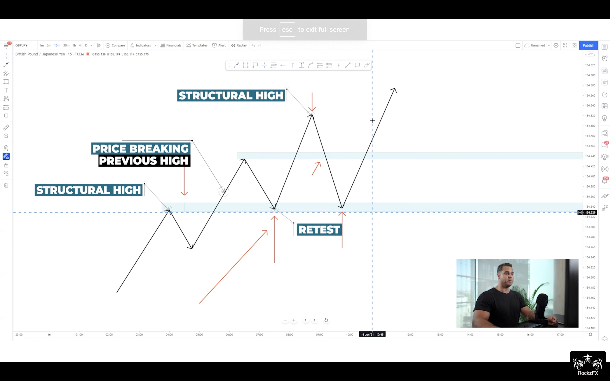
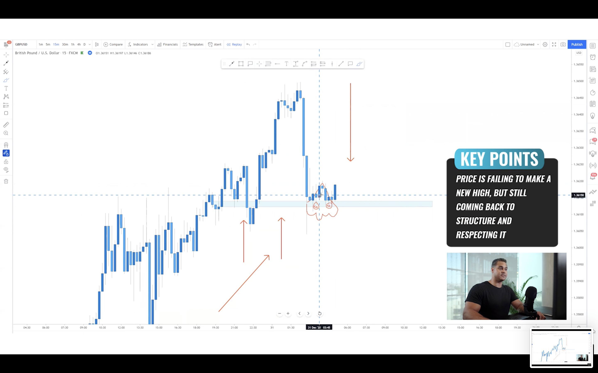
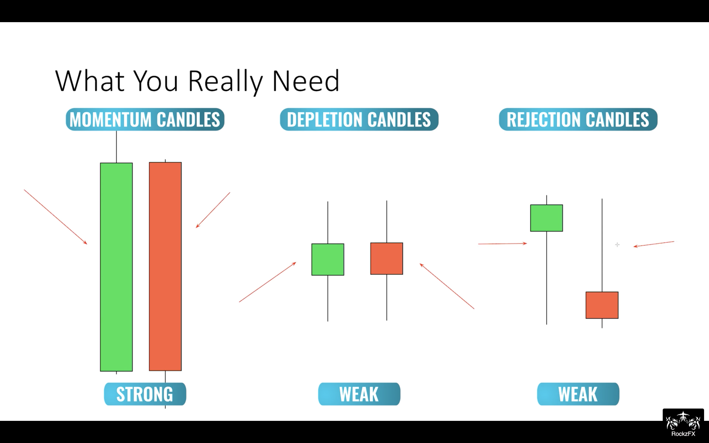
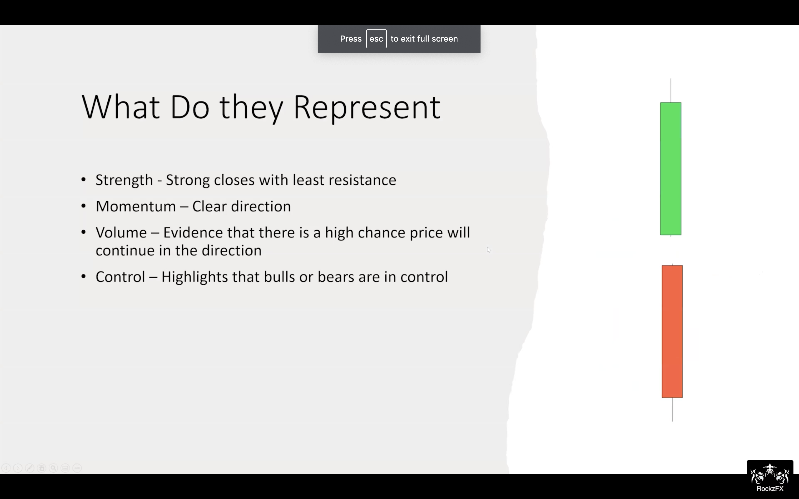
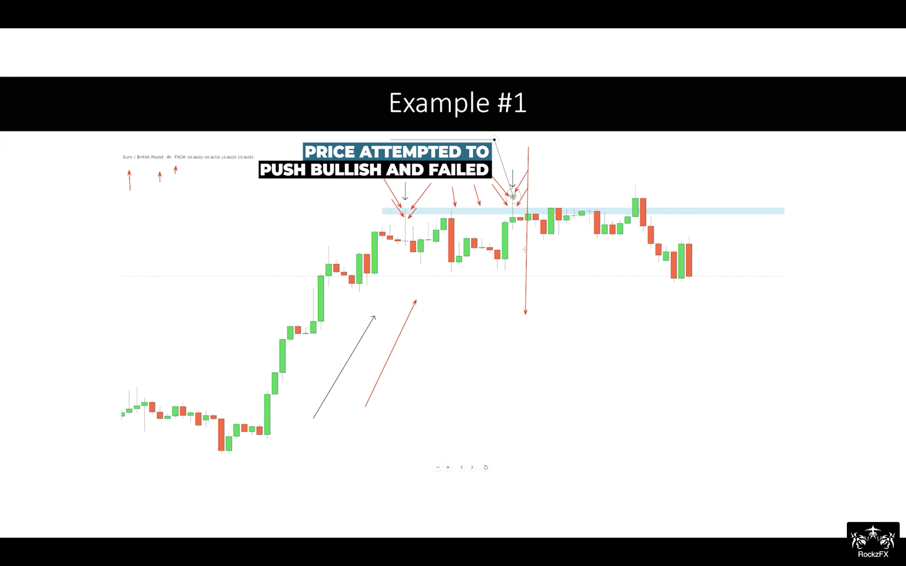

# Forex by RockzFx

---
# Agenda
0. [Master Class Bootcamp `Game of Probability`](#master-class-bootcamp)
1. [Master Class 1.0 `Keep it simple`](#master-class-10)
2. [Master Class 2.0 Part 1: `Multiple timeframe mastery`](#master-class-20-part-1)
3. [Master Class 2.0 Part 2:`Entries mastery`](#master-class-20-part-2)
4. [Master Class 3.0 `Single timeframe mastery`](#master-class-30)
5. [Master Class 4.0 `Scalping mastery`](#master-class-40)
6. [Practice and Sample](#practice-and-sample)
7. [Tip and Note](#tip-and-note)
8. [Challenge](#challenge)
9. [Daily Question & Ask](#daily-qa)
10. [Keynote](#keynote)
    - [Trading Process](#trading-process)
    - [Trading Perception](#trading-perception)
    - [Trading Rule](#trading-rule)
    - [Indicator](#indicator)
    - [Trading Pattern](#trading-pattern)
    - [Chart Pattern](#chart-pattern)
    - [Entry Pattern](#entry-pattern)
    - [Key Level](#key-level)
    - [Reading Value](#reading-value)
    - [Reading Chart](#reading-chart)
    - [Processing H4-H1-M15](#processing-h4-h1-m15)
    - [Processing H4-H1-M30](#processing-h4-h1-m30)
    - [Processing H4-H1-M1](#processing-h4-h1-m1)

---
# Master Class Bootcamp
`Game of Probability`
`The more Confluences, the more favour`
`Strategy = Structure(Constant), Pattern(Probability), Behaviour(Dynamic)`

It simply goes thru 3 step 
1. Market Structure - Identify direction bias [link](#market-structure)
2. Market Pattern - Identify setup [link](#market-pattern)
3. Market Bahaviour - Identify trigger by its behaviour [link](#market-bahaviour)

### Market Structure
`1. identify structure`
1. Identify `direction bias`
    1. Downtrend = LH and LL
    2. Uptrend = HH and HL
    3. Ranging

`Tip` : Identify 4H direction, then trade the same direction as 4H 

`Tip` : Focus on `TODAY`. Don't look back to far, we only need fresh trend not the major trend bcoz we are day trader; we get in and out the same day.

`Note` : Trade with the trend 
- trade when you can find direction bias clearly
- no trade for ranging market

`Note` : No matter what timeframe apply the same concept
- structure is structure
- H4 is holy grail for day trader 

2. Identify `2 levels`
    1. Uptrend = Latest higher high and higher low
    `Note` : we expect new High from price breaking above lastest higher high
    `Note` : we monitor price breaking below latest higher low because it is possibly sentiment change in the market. It doesn't mean market turnaround, it means erratic so get out of the market today

    2. Downtrend = Latest lower low and lower high

### Market Pattern
`2. identify setup` 

1. DownTrend
    1. Simple break and retest
        - spot previous low broken
        - anticipate pullback at previous **lower low** broken 
        
    2. Deep pullback
        - it retests *deeper* to previous **lower high** instead of **lower low**
        - `Note`: trend is only gonna reversed if it breaks previous lower low and lower high; otherwise, downtrend is still predominant. Thus, don't quickly jump into buy bias unless you see those levels has broken.
        
    3. Cheeseman
        - Similar to deep pullback, but it didn't create **lower low**. This shows more sign of reversal but hold on. Remember! reversal isn't gonna happen if previous **lower high** and **lower low** still hold 
        
        
    4. Reversal
        - Key is to succint sign of uptrend reversal which is 
            - fail to create higher high
            - violate previous higher low 
            - form lower low and high
            - breake recent lower low and retest it
        - `Note`: wait until trend is settle by showing break and retest
        
        
        
2. UpTrend
    1. Simple retest
        - classic break and retest in uptrend
        
        
    2. Deep pullback
        - Don't discount your buy bias just because simple retest isn't found
        
        
        
    3. Cheeseman
        - Again, fail to create **higher high** and respect previous **higher low**
        - `Note`: all you have to do is to watch closely if it's gonna break below **previous higher low** to revert the trend or respect for continuation
        - `Note`: momentum is really key to make a decision if you're riding on the continuation
        
        
        
        
    4. Reversal
        - `Note`: we're not looking for reversal but we stalker the trend with confluential evidence 
        
        
        
        
        

### Market Bahaviour 
`3. identify the trigger by candlestick bahaviour`

1. 3-candle Formation
    

    1. Momentum candle
        - `Tip`: main entry signal
    2. Depletion candle
        - no one in control
    3. Rejection candle / Wick rejection
        - `Tip`: more often than not it's sign of reversal 
        - bullish rejection: bear controls first then bull comes later
        - bearish rejection: bull comes first then losing power to bear    
2. Momentum candle - Strength, Momentum, Volume and Control
    1. Strength 
        - 
    2. Usage
        - `Tip`: Always wait for pullback since any continuation requires exhaustion
        - `!!!`: Structure + Key Level + Momentum = your only indicator
        - 
        - 
3. Depletion candle - Weakness, indecision 
    1. No direction, no decision 
        - 
    2. Usage
        - 
    3. `Tip`: more often than not price will continue in the direction that broke the range. So always mark range bound (high and low) to frame the price and anticipate the dominating control after range broken
    
    4. `Tip`: never more often than not price will continue in the direction that broke the range 
    5. `Note`: link all behaviour along especially what will be shown around key levels

4. Rejection candle- Weakness, failure, continuation/reversal
    1. price is really stimulus and it's about to reverse or resume
        - bullish rejection (wick @ bottom): while downtrend, bull tries very hard to push back the bear
        - bearish rejection (wick @ top): in uptrend, bear scorns the bull
        - 
    2. Usage
        - 
            - 1st bearish rejection in an uptrend means nothing since no level is formed yet. Only trending higher high and higher are shown. 
            - next bearish rejection means something (no decision yet). if momentum seems depleting, then reversal might be awaiting.
                - `Tip`: we dont trade reversal so do jumb right in. 
        - 
            - it's confluencing of wick rejection on bearish body
            - `Tip`: be careful! In this bullish reversal, you need **new level** to be developed to prove that bull is really in control now by breaking the 1st higher high and retest it for continuing in reversed trend. Otherwise, it is just a cheeseman (still bearish) 
        - 
            - 1st evidence, we see bullish rejection in the downtrend 
            - 2nd evidence, we don't see lower low in the downtrend, but **higher low** instead
            - 3rd evidence, we see bullish rejection at **higher low**
            - 4th evidence, we see price breaks the **recent high** with momentum candle
            - 5th evidence, we see price retests the **recent high**
            - 5 confluences confirm reversal 

---
[Back to Agenda](#agenda)
# Keynote

### Trading Process
1. Use `w1` for pivoting
2. Use `d1` to identify movement
3. Use `h4` to identify key level and structure high/low and direction
4. Use `h1` 
    - to monitor behaviour of price approaching the key level 
    - to monitor price approaching the key level 
5. Use `m30` and `m15` to monitor 1st sign of rejection
6. Enter with `momentum`, `valid SL, BE and RRR`
    1. Momentum
        1. Price must violate structure completely 
        2. Momentum shift in higher timeframe = break and retest in lower timeframe
    2. Valid SL 
        1. Must not be in the area that pullback might take place
        2. Must be hold/against the significant level 
        3. It must be able to make BE
    3. Valid BE
        1. Size of BE zone = Size of SL zone
        2. Once price violate BE, shift SL in to make a trade breakeven
    4. Valid RRR
        1. Range to next zone > 1:2RR
        2. 1:3 RR
        3. 5SL —> 15TP or 10SL —> 30TP
7. Document and retrospect 

### Trading Perception
1. Momentum shift in higher timeframe = Break and retest in lower timeframe
2. Changing level, trendline, HH, LL = `Trend`
3. Wick rejection = `Direction Bias`
4. Pattern = `Opportunity`
5. SL zone = Capital Shield or `Protective Zone`
    1. Price must not be greater than `50%` of the protective zone
    2. Use `Buy/Sell Stop` to wait for price to get back in the zone
6. Consolidation = `No Decision`
7. Best plan = Simple Stupid plan that is highly disciplined
8. News = Major `Market Correction`; it's not really manipulation but adjustment at the moment
9. Sunday & Monday = Marjor `Market Correction`; Sunday correction impact so be aware. 

### Trading Rule 
1. Trend
    - always analyse the `current only`
    - only `clear direction` to be analyzed
2. Entry
    - only Pattern must be discovered
    - enter only on a pullback
    - enter at key level
    - Only with Direction bias
    - Only with Momentum
    - Only valude 1:1`BE`
    - Only valid 1:2-1:3`RR` 
        - 1:2 if SL is wide 
    - `Wait - Behavior Signal`
        - Wait price come into `SL zone` before triggering a trade with `STOP Order`
        
        > For `Stop Order`, try to make the entry **at the centre** as much as possible. Manipulate it in the range we bet. Ex. We know anticipating SL and current price (close). Then, stop order entry = current price (close) - (SL-current price (close)). The same range to make it at the centre

        - Wait at least `1 x h4/h1 close` at key level before proceeding = not to be the 1st one
        - Wait at least `2 x h1 rejection` at key level to confirm failing to break = not to be the 1st one
        - Enter only with `2 wick rejections` regardless of other patterns
    - `Wait - Structure`
        - Downtrend = LH+LL 
        - Uptrend = HH+HL
        - Downtrend-Double Top (DDT) = cheeseman
            - DB = reversal but we don’t take reversal 
        - Uptrend-Double Bottom (DDB) = cheeseman
            - DT = reversal but we don’t take reversal
3. SL
    - Always above key level
4. Take Profit
    - Always enough room to take profit and momentum 
5. BE
    - always partially close 50% at major level 
    - let another 50% left for letting it all run and hit TP
6. Mindset
    - Keep it Simple always
    - Never anticipate for a reversal (Never be the 1st to get in; let market prove itself)
    - Never forecast but react with processes
7. No trade 
8. Time
    - Time range= 5-8p-10p
    - Focus on 30min before NY Open = 7.30p
9. NEWS and Events
    - NEWS, manage position if I am in; otherwise, decide wisely if news can benefit the entry

### Indicator
1. SMA200 - direction
2. `EMA50` - mean value. In forex, **price always approaches the mean value** which is more comfortable 
3. EMA14 - immediate movement

### Trading Pattern 
1. Simple trending 
    1. Direction
        1. Uptrend: buy at HL: if it doesn’t break h4 low, wait for retest and rejection before buy
        2. Downtrend: sell at LH: if it doesn’t break h4 high, wait for retest and rejection before sell
    2. Formation
        1. pullback and momentum push = HL/HH or LH/LL
        2. Pullback and failed push (double top/bottom) = HL/lower High or LH/higher Low
2. Break structure, wait for retest
3. Break trendline, wait for retest 
4. Double top/bottom, wait for momentum or broken structure  
5. Missed Double top/bottom, wait for momentum or broken structure
6. V-shape by engulf first, wait for coming pinbar afterwards
7. Consolidation: wait for break structure and retest 
8. Double top/Trending market + Breakout, wait for  break back in + retest: Sell stop
9. Break-out-Break-backin on H4 only
10. Double top/bottom on H1/H4 only

### Chart Pattern
`Chart pattern forms strategy`

[More detail in bootcamp / chart pattern](#market-pattern)
1. Simple break and retest - `continuation`: break retest 1st level
2. Deep pullback - `continuation`: break and retest 2nd level
3. Cheeseman - `continuation`: not break and retest 2nd level
4. Reversal - `reversal`: not break but break 2nd level reversely  

### Entry Pattern 
1. 4H Wick Rejection
2. Breakout 50% retracement
3. Over-extended continuation
4. Bottom/Double Top continuation
5. Fail to break above/below

### Key Level
`No such perfect line` 
We need Only `Structure` since it's dynamic and responsive to current market sentiment

1. Structure Highs 
2. Structure Lows
3. `Strong Level`
    - `V-shape`: it signifies big orders there. Then, wait for double top/bottom at that level
    - `Bull/Bear trap`
    - `BOBBI`
    - `SL Hunt`
4. Broken trendline
5. `1W` Pivot

### Reading Value 
1. EURUSD = `4` floating points ex. 1.22096 - 1.22008 = 0.`0008`8 = 8.8 pips
2. USDJPY = `2` floating points ex. 104.614 - 104.462 = 0.`15`2 = 15.2 pips
3. Gold = `-2` floating points ex. 1284.12 - 1282.12 = 2`.`00 = 200 pips 

### Reading Chart
1. Always look from right to left
2. When new structure was formed in H4, we disregard the past. Especially, when we anticipate the double top/bottom, it won’t be validated anymore. Thus, when new structure was formed, we won’t expect the trend resuming but new reversal trending. However, if we cannot spot the new structure, we can still anticipate the resuming of the current trend.
3. Find bias in H4, then anticipate pattern and behaviour from H1 and M15 respectively.

### Processing H4-H1-M15 
1. Key takeaway
    1. It is more aggressive ( faster entrance )
    2. It closes BE more often
2. Pattern
    1. Pullback 50% then continue
    2. Breakout, break back-in, retest, then continue
3. Tips
    1. Confirm by 1 x H4 close 

### Processing H4-H1-M30 
1. Key takeaway
2. Pattern
    1. Break trend line and form double top/bottom
    2. Break structure and retest
    3. Break structure, fail to retest, then form double top/bottom
    4. Fail to break structure, form double top/bottom
3. Tips

--- 
