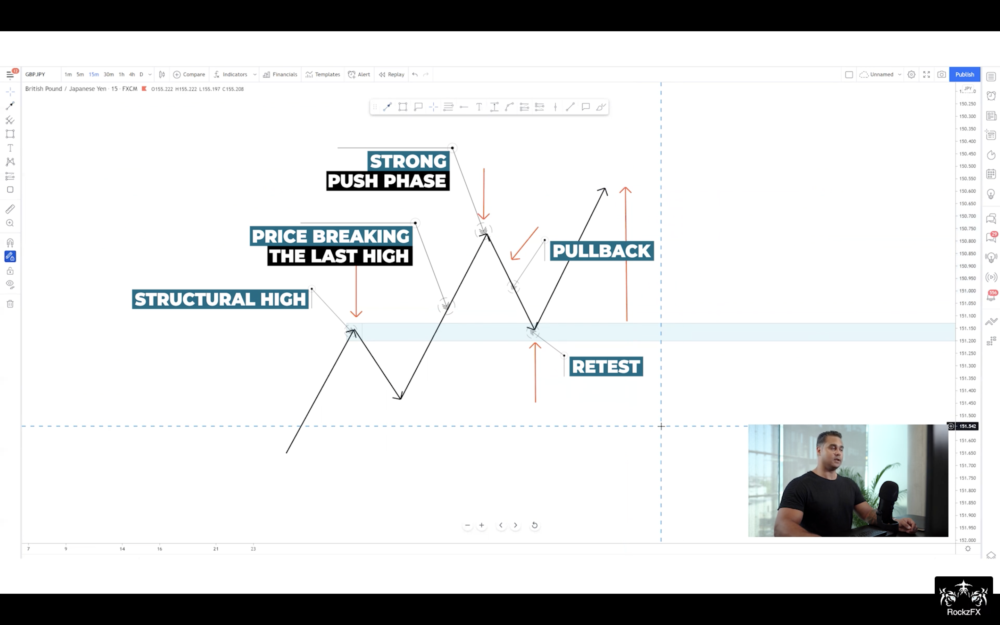
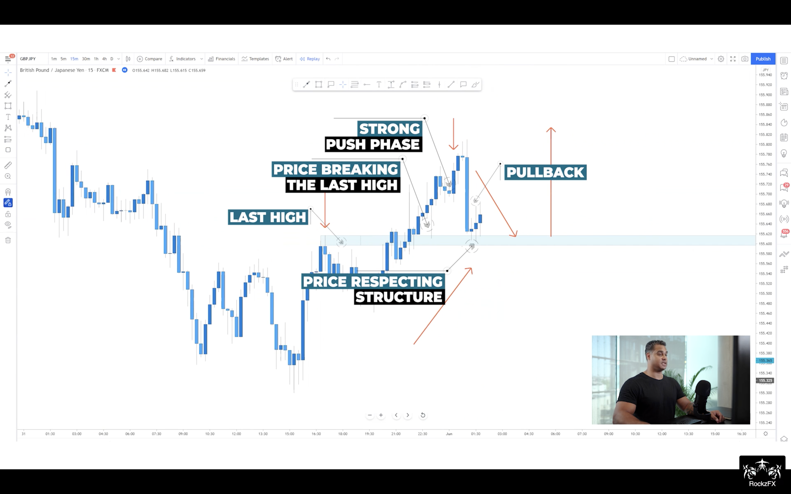
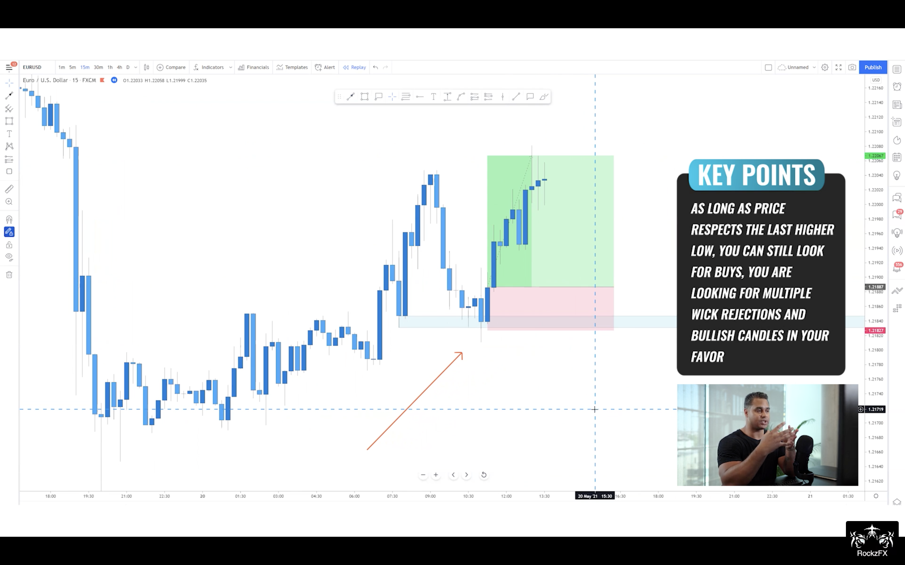
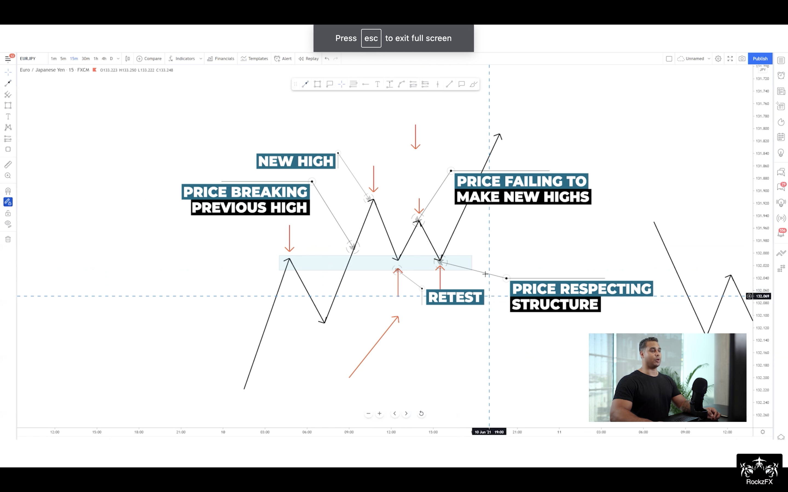
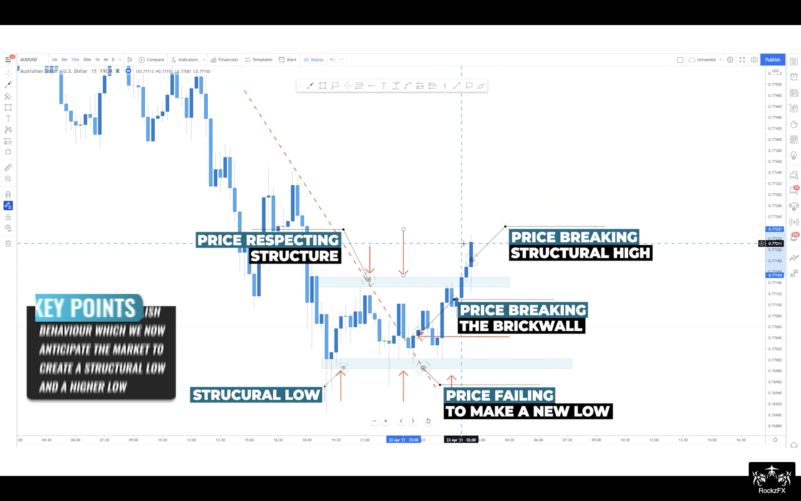
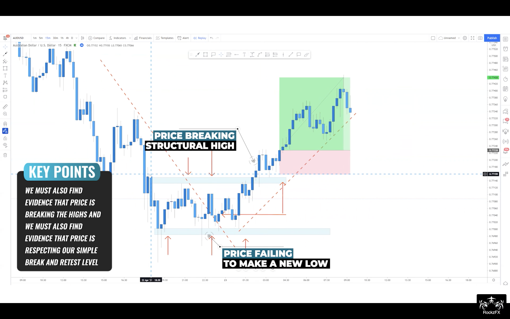
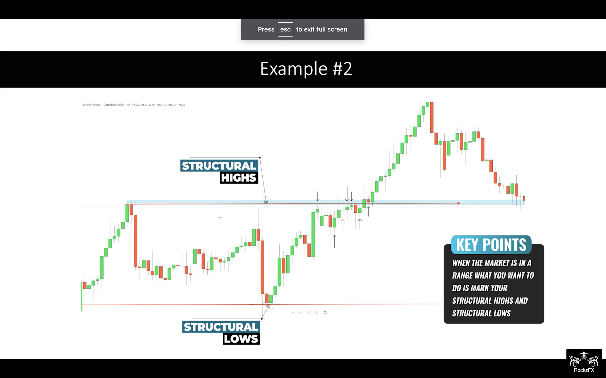
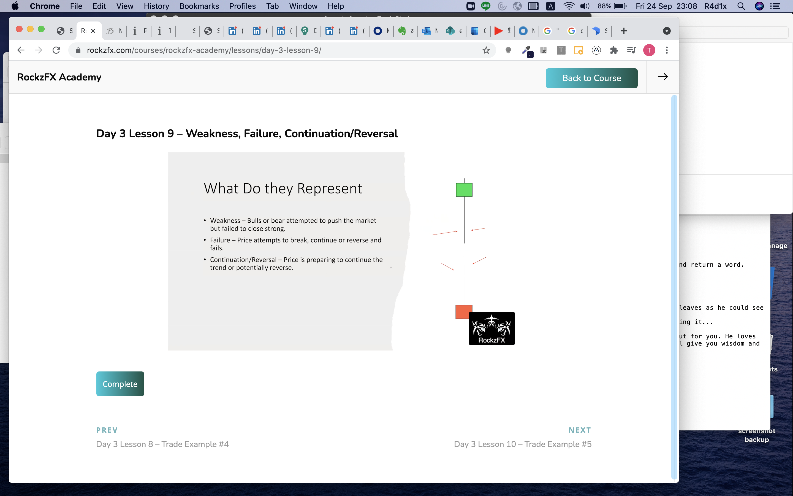

# Forex by RockzFx

---
# Agenda
0. [Master Class Bootcamp `Game of Probability`](#master-class-bootcamp)
1. [Master Class 1.0 `Keep it simple`](#master-class-10)
2. [Master Class 2.0 Part 1: `Multiple timeframe mastery`](#master-class-20-part-1)
3. [Master Class 2.0 Part 2:`Entries mastery`](#master-class-20-part-2)
4. [Master Class 3.0 `Single timeframe mastery`](#master-class-3)
5. [Master Class 4.0 `Scalping mastery`](#master-class-4)
6. [Practice and Sample](#practice-and-sample)
7. [Tip and Note](#tip-and-note)
8. [Challenge](#challenge)
9. [Daily Question & Ask](#daily-qa)
10. [Grocery](#grocery)
    - [Trade Process](#trade-process)
    - [Trade Perceptive Intuition](#trade-perceptive-intuition)
    - [Indicator](#trade-indicator)
    - [Pattern](#trade-pattern)
    - [Chart Pattern](#pattern-chart)
    - [Entry Pattern](#pattern-entry)
    - [Rule](#trade-rule)
    - [Key Level](#trade-key-level)
    - [Reading Value](#read-value)
    - [Reading Chart](#read-chart)
    - [Processing H4-H1-M15](#h4-h1-m15)
    - [Processing H4-H1-M30](#h4-h1-m30)
    - [Processing H4-H1-M1](#h4-h1-m1)

---
# Master Class Bootcamp
`Game of Probability`
`The more Confluences, the more favour`
`Strategy = Structure(Constant), Pattern(Probability), Behaviour(Dynamic)`
`3-simple-thing to be examined`

### Market Structure
`1. identify structure`

1. Identify direction bias
    1. Downtrend = LH and LL
    2. Uptrend = HH and HL
    3. Ranging

`Tip` : Identify 4H direction, then trade the same direction as 4H 

`Tip` : Focus on `TODAY`. Don't look back to far, we only need fresh trend not the major trend bcoz we are day trader; we get in and out the same day.

`Note` : Trade with the trend 
- trade when you can find direction bias clearly
- no trade for ranging market

`Note` : No matter what timeframe apply the same concept
- structure is structure
- H4 is holy grail for day trader 

2. Identify 2 levels
    1. Uptrend = Latest higher high and higher low
    `Note` : we expect new High from price breaking above lastest higher high
    `Note` : we monitor price breaking below latest higher low because it is possibly sentiment change in the market. It doesn't mean market turnaround, it means erratic so get out of the market today

    2. Downtrend = Latest lower low and lower high

### Chart Patterns
`2. identify setup` 

1. DownTrend
    1. Simple break and retest
        - spot previous low broken
        - anticipate pullback at previous **lower low** broken 
        
    2. Deep pullback
        - it retests *deeper* to previous **lower high** instead of **lower low**
        - `Note`: trend is only gonna reversed if it breaks previous lower low and lower high; otherwise, downtrend is still predominant. Thus, don't quickly jump into buy bias unless you see those levels has broken.
        
    3. Cheeseman
        - Similar to deep pullback, but it didn't create **lower low**. This shows more sign of reversal but hold on. Remember! reversal isn't gonna happen if previous **lower high** and **lower low** still hold 
        
        
    4. Reversal
        - Key is to succint sign of uptrend reversal which is 
            - fail to create higher high
            - violate previous higher low 
            - form lower low and high
            - breake recent lower low and retest it
        - `Note`: wait until trend is settle by showing break and retest
        
        
        
2. UpTrend
    1. Simple retest
        - classic break and retest in uptrend
        
        
    2. Deep pullback
        - Don't discount your buy bias just because simple retest isn't found
        
        
        
    3. Cheeseman
        - Again, fail to create **higher high** and respect previous **higher low**
        - `Note`: all you have to do is to watch closely if it's gonna break below **previous higher low** to revert the trend or respect for continuation
        - `Note`: momentum is really key to make a decision if you're riding on the continuation
        
        
        
        
    4. Reversal
        - `Note`: we're not looking for reversal but we stalker the trend with confluential evidence 
        
        
        
        
        

### Candlestick 
`3. identify the trigger by its bahaviour`

1. 3-candle Formation
    

    1. Momentum candle
        - `Tip`: main entry signal
    2. Depletion candle
        - no one in control
    3. Rejection candle / Wick rejection
        - `Tip`: more often than not it's sign of reversal 
        - bullish rejection: bear controls first then bull comes later
        - bearish rejection: bull comes first then losing power to bear    
2. Momentum candle - Strength, Momentum, Volume and Control
    1. Strength 
        - 
    2. Usage
        - `Tip`: Always wait for pullback since any continuation requires exhaustion
        - `!!!`: Structure + Key Level + Momentum = your only indicator
        - 
        - 
3. Depletion candle - Weakness, indecision 
    1. No direction, no decision 
        - 
    2. Usage
        - 
    3. `Tip`: more often than not price will continue in the direction that broke the range. So always mark range bound (high and low) to frame the price and anticipate the dominating control after range broken
    
    4. `Tip`: never more often than not price will continue in the direction that broke the range 
    5. `Note`: link all behaviour along especially what will be shown around key levels

4. Rejection candle- Weakness, failure, continuation/reversal
    1. price is really stimulus and it's about to reverse or resume
        - bullish rejection (wick @ bottom): while downtrend, bull tries very hard to push back the bear
        - bearish rejection (wick @ top): in uptrend, bear scorns the bull
        - 
    2. Usage
        - 
            - 1st bearish rejection in an uptrend means nothing since no level is formed yet. Only trending higher high and higher are shown. 
            - next bearish rejection means something (no decision yet). if momentum seems depleting, then reversal might be awaiting.
                - `Tip`: we dont trade reversal so do jumb right in. 
        - 
            - it's confluencing of wick rejection on bearish body
            - `Tip`: be careful! In this bullish reversal, you need **new level** to be developed to prove that bull is really in control now by breaking the 1st higher high and retest it for continuing in reversed trend. Otherwise, it is just a cheeseman (still bearish) 
        - 
            - 1st evidence, we see bullish rejection in the downtrend 
            - 2nd evidence, we don't see lower low in the downtrend, but **higher low** instead
            - 3rd evidence, we see bullish rejection at **higher low**
            - 4th evidence, we see price breaks the **recent high** with momentum candle
            - 5th evidence, we see price retests the **recent high**
            - 5 confluences confirm reversal 

[Back to Agenda](#agenda)

--- 
# Master Class 1.0
link to the second place.  
link to the second place.  
link to the second place.  
link to the second place.  
link to the second place.  
link to the second place.  

# Master-class 2.0 Part 1
link to the second place.  
link to the second place.  
link to the second place.  
link to the second place.  
link to the second place.  
link to the second place.  

# Master-class 2.0 Part 2
link to the second place.  
link to the second place.  
link to the second place.  
link to the second place.  
link to the second place.  
link to the second place.  

---
### Place 1

Hello, this is some text to fill in this, [here](#place-2), is a 
link to the second place.  
link to the second place.  
link to the second place.  
link to the second place.  
link to the second place.  
link to the second place.  
link to the second place.  
link to the second place.  
link to the second place.  
link to the second place.  
link to the second place.  
link to the second place.  
link to the second place.  
link to the second place.  
link to the second place.  
link to the second place.  
link to the second place.  
link to the second place.  
link to the second place.  
link to the second place.  
link to the second place.  
link to the second place.  
link to the second place.  
link to the second place.  
link to the second place.  
link to the second place.  
link to the second place.  
link to the second place.  
link to the second place.  
link to the second place.  
link to the second place.  
link to the second place.  

### Place 2 

Place one has the fun times of linking here, but I can also link back [here](#place-1).
link to the second place.  
link to the second place.  
link to the second place.  
link to the second place.  
link to the second place.  
link to the second place.  
link to the second place.  
link to the second place.  
link to the second place.  
link to the second place.  
link to the second place.  
link to the second place.  
link to the second place.  
link to the second place.  
link to the second place.  
link to the second place.  
link to the second place.  
link to the second place.  
link to the second place.  
link to the second place.  
link to the second place.  
link to the second place.  
link to the second place.  
link to the second place.  
link to the second place.  
link to the second place.  
link to the second place.  
link to the second place.  
link to the second place.  
link to the second place.  
link to the second place.  
link to the second place.  

### Place's 3: other example

Place one has the fun times of linking here, but I can also link back [here](#places-3-other-example)