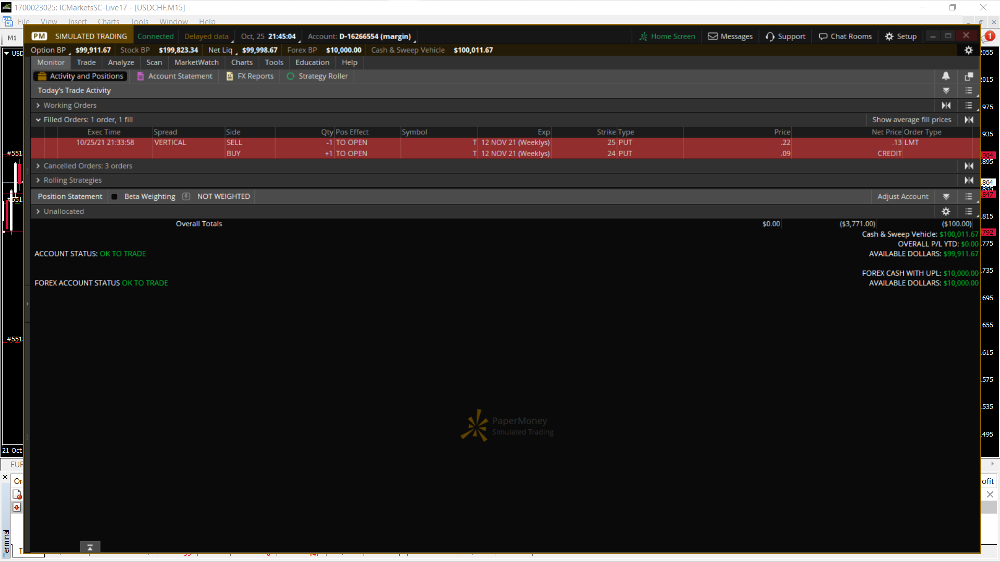

[/] 2.0
[!] pattern and process
[ ] trading plan
[ ] 3.0
[ ] 4.0

[ ] 100 challenge 
[ ] break and retest sim
[ ] Jan'21 - journal guide
[ ] Jan'21 - morning analysis
[ ] Jan'21 - evening review
[ ] Jan'21 - live 
[ ] Jan'21 - q & a
[ ] Jan'21 - 1M
[ ] Feb'21 - 100 trade challenge review
[ ] Mar'21 - PEP Talk
[ ] Jun'21 - Morning setup
[ ] Sep'21 - Mindset workshop
[ ] Oct'21 - Rockzfx promise

### 25-OCT-21

`Thought`
- T, AT&T was studied since I have worked this case before at that time

`Trade`

- T, entry with vertical spread 25/24 @ 12-NOV-21 for .13 
