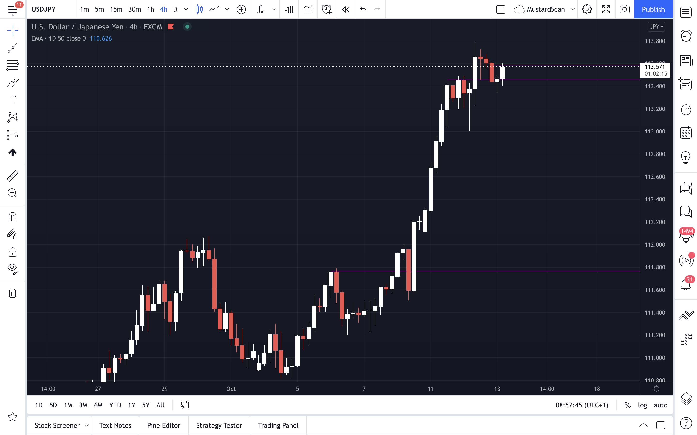
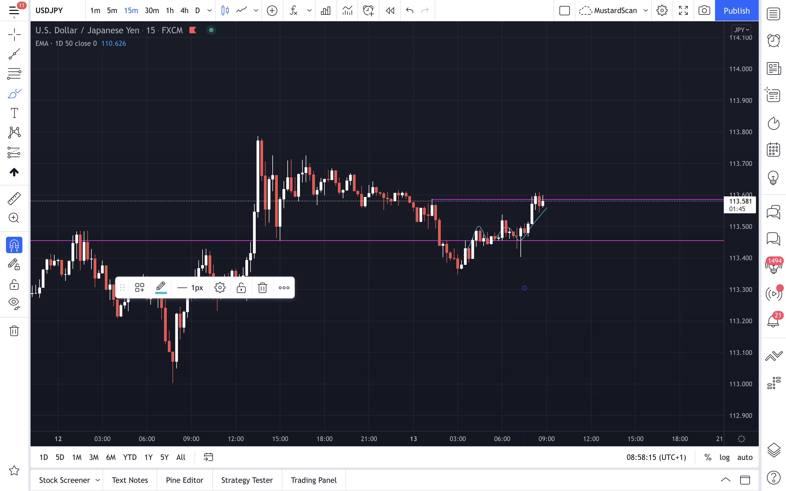
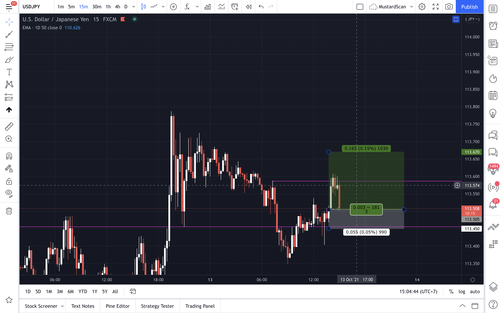
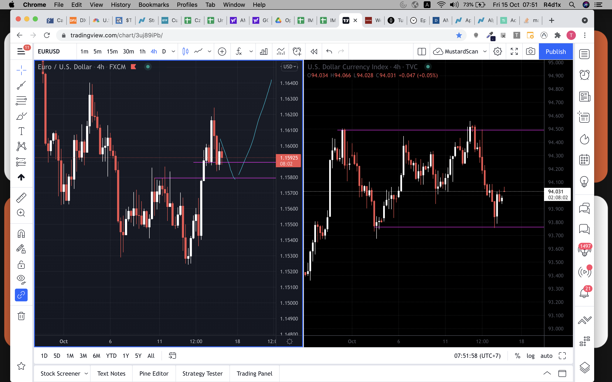
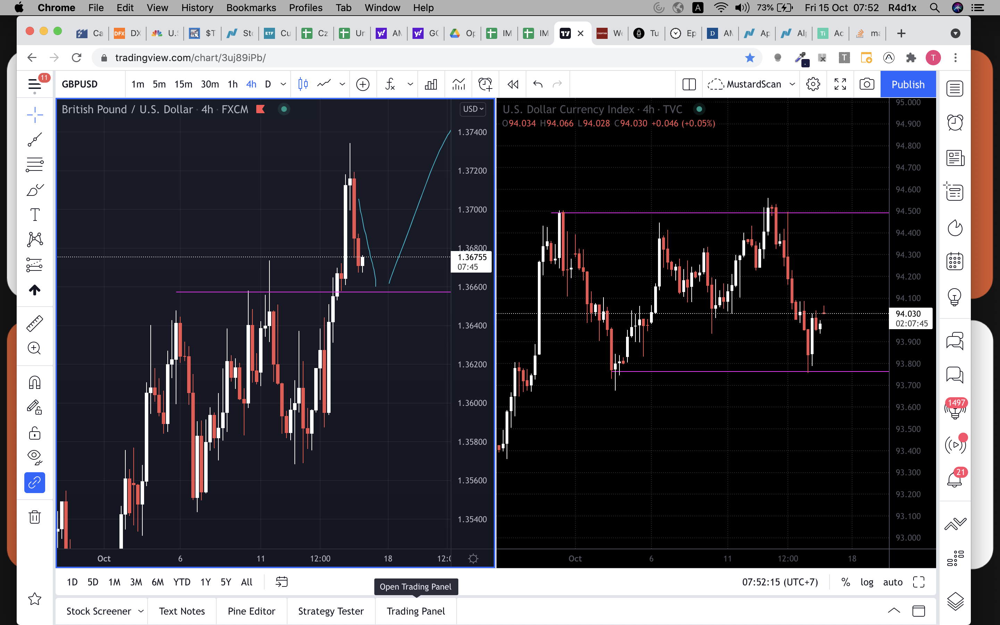

# Forward Testing

Japan open 8a = 6a BKK
London-am open 9a = 3p BKK 
London-pm open 2p = 8p BKK
New York open 8a = 7p BKK
4H close = `12p`(8-12), `4p`(12-4) **LDN open @ 3p**, `8p`(4-8) **NY open @ 7p**

---

### 11-OCT-21
`Thought` I can't see much of clear direction so wait until 9p before leaving charts.
- GBPUSD, looks like uptrend but hesitate to break above to create new level 
- USDJPY, uptrend but no clear level to refer
- USDCHF, look like cheeseman, but it's quite inerted so wait for cheeseman + break & retest
- EURUSD, looks like break & retest but lack of momentum downward
- XAUUSD, ranging for 2 weeks

### 12-OCT-21
`NEWS` FOMC/USD, member Clarida & Bostic speaks
`Thought` none of major is tradable bcoz of no direction formed
- WBRUSD/WTIUSD, broke and going to retest but not yet
- rebuilding the IMP stocks

### 13-OCT-21
`NEWS` CPI/USD, release

`Thought` 
- before 4p (pre-london), it seems ranging across the major except USDJPY
- after 4p, 
    - EURUSD, double top possibility in the downtrend
    - USDJPY, BNR but no momentum; anticipate double bottom 
    - WTIUSD, about to break; anticipate BNR downward

`CPI`
- **Consumer Price Index**
- give timely glimpse into current growth and inflation levels. It tracks purchasing power and the rise of prices of goods and services in economy. 
- CPI = avg(price changes of each item of consumer goods including food, energy, services, and medical care)
- higher inflation = higher interest rates = **strengthener** currency
- used in conjunction with `PPI`(**Producer Price Index**)

`Lesson` 
- USDJPY, 7.15a London, I missed 5pips from the entry of double bottom formed in the uptrend worth

### 14-OCT-21
`NEWS` PPI/USD
`Thought` 
- before 6p, no time to chart since hanging out with Lily 
- after 6p, GBPUSD and EURUSD broke above after ranging almost 2 weeks since DXY gets weakened on 13-OCT. However, dolla gets strengthened today at NY open. anticipate retest tomorrow. 

### 15-OCT-21
`Thought`
- before 8a, dollar rise is rejected, so retest is highly probable today around before LDN open
 
