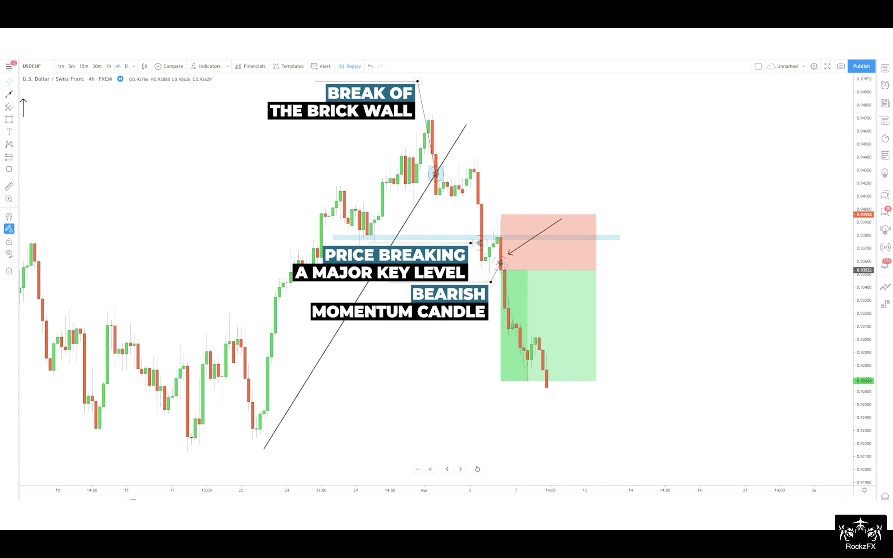
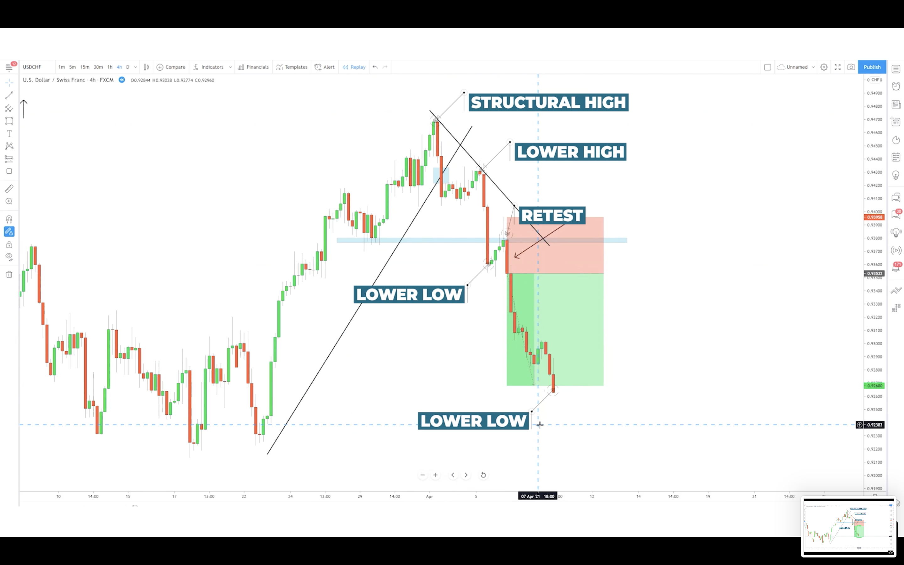
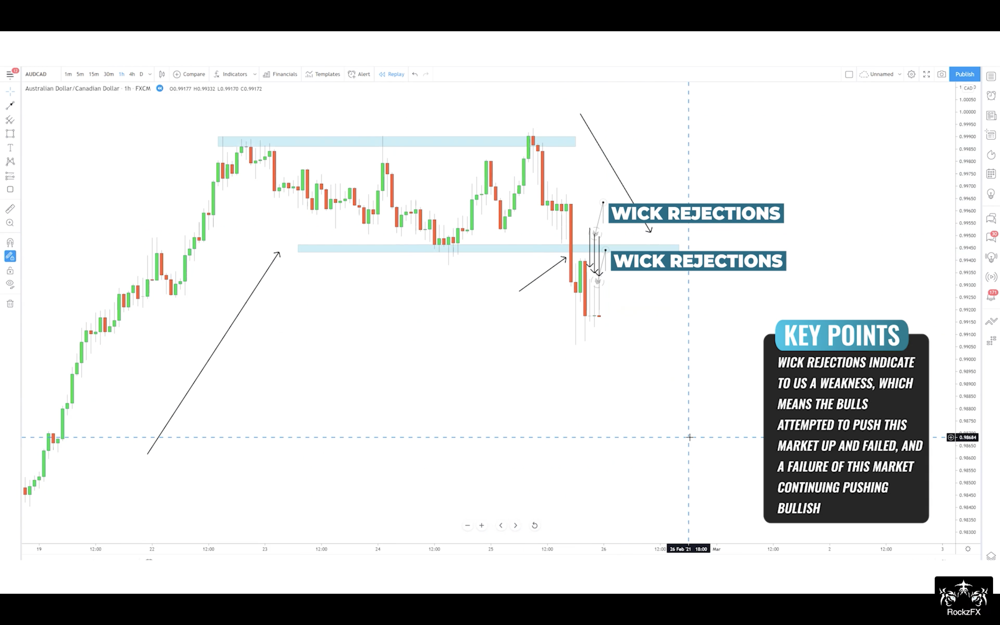
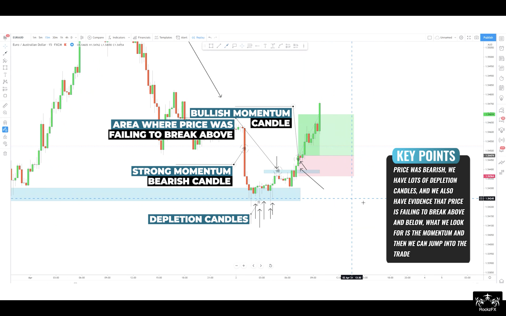
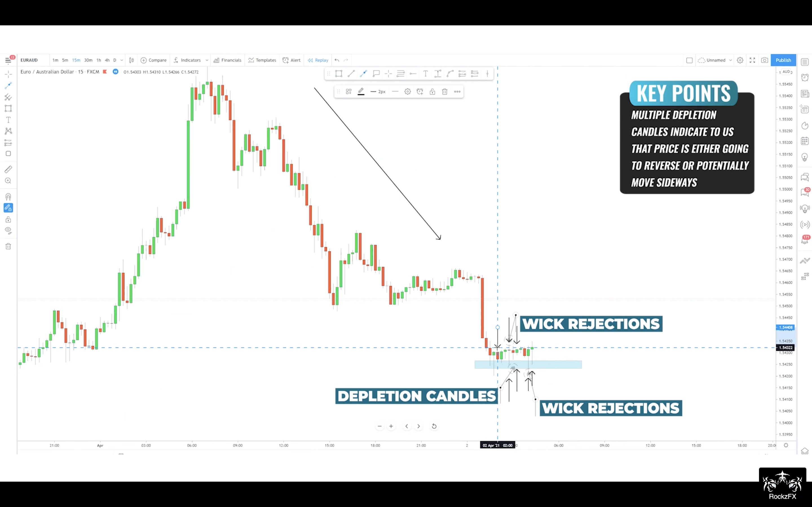
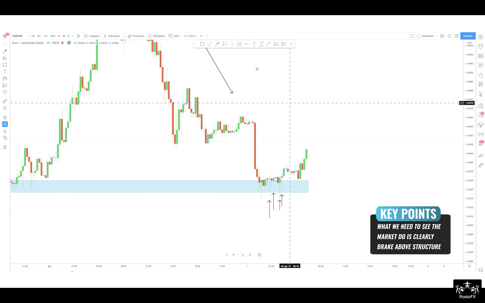
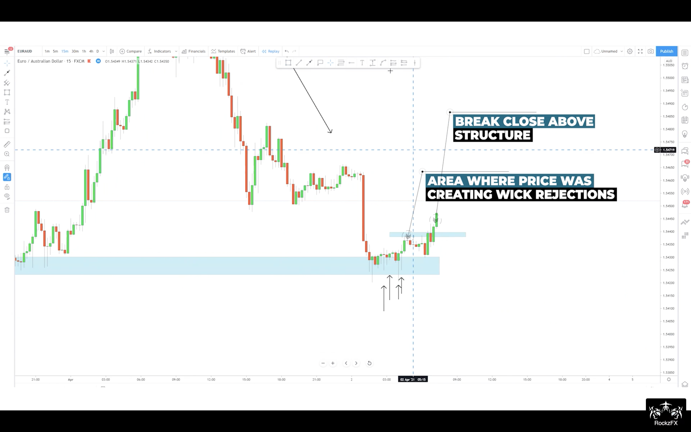

# Forex by RockzFx

---
# Agenda
0. [Master Class Bootcamp](#bootcamp)
1. [Master Class 1.0 `Keep it simple`](#master-class-1)
2. [Master Class 2.0 `Multiple timeframe mastery`](#master-class-2)
3. [Master Class 3.0 `Single timeframe mastery`](#master-class-3)
4. [Master Class 4.0 `Unrivalled 1M scalping`](#master-class-4)
5. [Practice and Sample](#practice-and-sample)
6. [Tip and Note](#tip-and-note)

--- 
# Master Class Bootcamp {#bootcamp} 
`Trend Trading, Game of Probability, More Confluences`
`Strategy = Structure(Constant), Pattern(Probability), Behaviour(Dynamic)`

### 3-simple-thing to be examined
1. Market Structure
    1. Identify direction
        1. Downtrend = LH and LL
        2. Uptrend = HH and HL
        3. Ranging

    `Tip` : Identify 4H direction, then trade the same direction as 4H 
    
    `Tip` : Focus on `TODAY`. Don't look back to far, we only need fresh trend not the major trend bcoz we are day trader; we get in and out the same day.

    `Note` : Trade with the trend 
    - trade when you can find direction bias clearly
    - no trade for ranging market

    `Note` : No matter what timeframe apply the same concept
    - structure is structure
    - H4 is holy grail for day trader 

    2. Identify 2 levels
        1. Uptrend = Latest higher high and higher low
        `Note` : we expect new High from price breaking above lastest higher high
        `Note` : we monitor price breaking below latest higher low because it is possibly sentiment change in the market. It doesn't mean market turnaround, it means erratic so get out of the market today

        2. Downtrend = Latest lower low and lower high
2. Chart Patterns - identify setup
    1. DownTrend
        1. Simple break and retest
            - spot previous low broken
            - anticipate pullback at previous **lower low** broken 
            
        2. Deep pullback
            - it retests *deeper* to previous **lower high** instead of **lower low**
            - `Note`: trend is only gonna reversed if it breaks previous lower low and lower high; otherwise, downtrend is still predominant. Thus, don't quickly jump into buy bias unless you see those levels has broken.
            
        3. Cheeseman
            - Similar to deep pullback, but it didn't create **lower low**. This shows more sign of reversal but hold on. Remember! reversal isn't gonna happen if previous **lower high** and **lower low** still hold 
            
            
        4. Reversal
            - Key is to succint sign of uptrend reversal which is 
                - fail to create higher high
                - violate previous higher low 
                - form lower low and high
                - breake recent lower low and retest it
            - `Note`: wait until trend is settle by showing break and retest
            
            
            
    2. UpTrend
        1. Simple retest
            - classic break and retest in uptrend
            
            
        2. Deep pullback
            - Don't discount your buy bias just because simple retest isn't found
            
            
            
        3. Cheeseman
            - Again, fail to create **higher high** and respect previous **higher low**
            - `Note`: all you have to do is to watch closely if it's gonna break below **previous higher low** to revert the trend or respect for continuation
            - `Note`: momentum is really key to make a decision if you're riding on the continuation
            
            
            
            
        4. Reversal
            - `Note`: we're not looking for reversal but we stalker the trend with confluential evidence 
            
            
            
            
            
3. Candlestick - identify the trigger
    1. Behaviour
    2. 3-candle Formation
        

        1. Momentum candle
            - `Tip`: main entry signal
        2. Depletion candle
            - no one in control
        3. Rejection candle / Wick rejection
            - `Tip`: more often than not it's sign of reversal 
            - bullish rejection: bear controls first then bull comes later
            - bearish rejection: bull comes first then losing power to bear    
    3. Momentum candle - Strength, Momentum, Volume and Control
        1. Strength 
            - 
        2. Usage
            - `Tip`: Always wait for pullback since any continuation requires exhaustion
            - `!!!`: Structure + Key Level + Momentum = your only indicator
            - 
            - 
    4. Depletion candle - Weakness, indecision 
        1. No direction, no decision 
            - 
        2. Usage
            - 
        3. `Tip`: more often than not price will continue in the direction that broke the range. So always mark range bound (high and low) to frame the price and anticipate the dominating control after range broken
        
        4. `Tip`: never more often than not price will continue in the direction that broke the range 
        5. `Note`: link all behaviour along especially what will be shown around key levels

    5. Rejection candle- Weakness, failure, continuation/reversal
        1. price is really stimulus and it's about to reverse or resume
            - bullish rejection (wick @ bottom): while downtrend, bull tries very hard to push back the bear
            - bearish rejection (wick @ top): in uptrend, bear scorns the bull
            - 
        2. Usage
            - 
                - 1st bearish rejection in an uptrend means nothing since no level is formed yet. Only trending higher high and higher are shown. 
                - next bearish rejection means something (no decision yet). if momentum seems depleting, then reversal might be awaiting.
                    - `Tip`: we dont trade reversal so do jumb right in. 
            - 
                - it's confluencing of wick rejection on bearish body
                - `Tip`: be careful! In this bullish reversal, you need **new level** to be developed to prove that bull is really in control now by breaking the 1st higher high and retest it for continuing in reversed trend. Otherwise, it is just a cheeseman (still bearish) 
            - 
                - 1st evidence, we see bullish rejection in the downtrend 
                - 2nd evidence, we don't see lower low in the downtrend, but **higher low** instead
                - 3rd evidence, we see bullish rejection at **higher low**
                - 4th evidence, we see price breaks the **recent high** with momentum candle
                - 5th evidence, we see price retests the **recent high**
                - 5 confluences confirm reversal 

### Key Level
1. simple retest level
    - 
        - simple break and retest - recent level is somehow the most important as we are day trader
2. cheeseman
    - 
    - normal cheeseman: double top shown in deep pullback with fail to break to create lower low
    - upside down cheeseman: double bottom shown in deep pullback with fail to break to create higher high  
3. example
    - 
        - 
    - 
        - 
        - bull tryna push up but fail by leaving its wick at top
    - 
        - 
            - `Tip`: when we see depletion candles, we **must wait** to see who will be in control, and may look back in chart to the left to spot the important level. Because, market is indecisive at this level so there must be some **evidence in the past**. 
            - 
            - `Tip`: wait only until momentum candle comes to show us who is in control (bull or bear)
            - 
            - After market reveals direction, then we need to wait further structure (higher/lower high/low)to be developed
            - 

### Your thought process count! 
Don't rush
Don't skip
Don't try to make money
Follow rules and processes

### Multiple timeframe confluence 
`4H-1H-15M/30M`
xx

---
# Master Class 1.0 {#master-class-1} 
`Keep it simple`

> Only Analyze clear and current Trend, and Enter with proven Momentum with valid Risk management

1. Market Phase
2. Candlestick and Indicator
    1. Candlestick
    2. Indicator
    - SMA200 - direction
    - EMA50 - mean value (forex comforts mean value)
    - EMA14 - immediate movement

3. MST KISS - Pattern and Process 
    3.1 Price level
        - Structure High/Low
        - Recent level
        - Retesting level
        - Breaking out level
        - Strong level = v-shape bcoz big order is there

4. Break and Retest 
5. Trading Rules
    1. **2 Repairs max**.
    2. News = mostly be market correction = avoid or manage/exit position 
    3. Sunday/Monday = mostly be market correction = manage position
    4. Trade time: 5-10p (especially 730p)
    5. **Manage position**
        1. When price approach BE, close 50% and shift SL for free trade
        2. Stop order: to wait for price to get back in the zone 
            1. Entry with price in the middle of SL zone - manipulate range we bet
            2. Stop order entry = close +/- absolute(SL - close)
    6. Criteria
        - Keep it Simple Always
        - Enter only with Momentum - wick rejection, level down 
        - Pattern must be recognised
        - Buy when
            - Trending up
            - Reversing up
            - **HL** ( doesn’t have to be perfect )
                - If price is in buy market + doesn’t break h4 structure lows, wait for retest
                - anticipate rejection as potential signal 
                - Enter with valid SL and RRR
        - Sell when
            - Trending down
            - Reversing down  
            - **LH**
                - If pricing in sell market + doesn’t break h4 structure lows, wait for retest
                - anticipate rejection as potential signal 
                - Enter with valid SL and RRR
        - Range to next zone must be greater than 1:2 to accommodate 1:2RR
        - SL area must not be in the area where potential pullback might take place 
        - Wait until price come into SL area before triggering a trade 
        - Wait at least 1 x h4 (or 1 x h1) close at key level to proceed
        - Wait at least 2 x h1 rejection at key level to confirm price has attempted to break but failed 
        - No trade if you can’t recognise pattern or things don’t fit our criteria 
        - Trading time = 10-2 o’clock GMT (4 hr a day) ~ 5-8p TH time
        - Focus = 30hr before NY open 
        - Pull away from chart = 4 o’clock GMT ( London close )

6. Trading Plan 
`Clear Trend + Proven Momentum + Risk Management`

    1.  Clear and Current **Trend**  — H4
        - Trending/Cont. Pattern (Pattern + Direction = opportunity)
            - HH+HL / LL+LH with break-and-retest (previous level or trend line)
            - HH+HL / LL+LH with break and 50% pullback
            - HH+HL (uptrend) with break-and-fail-to-retest-but-form-Double Bottom (accumulation) —> no new structure just drop
            - LL+LH (downtrend) with break-and-fail-to-retest-but-form-Double Top (distribution) —> no new structure just drop
            - (Ranging) Break-out-Break-Back-in, retest, then continue 
                - Consolidation = no decision
            - Reversal sign: Never anticipate a reversal !
                - Break trend line + form new structure + retest with success pattern
                    - (Downtrend to uptrend): HH+HL —> double bottom
                    - (Uptrend to downtrend): LH+LH —> double top
                - Break trend line + form new structure + retest with failed pattern
                    - (Downtrend to uptrend): HH+HL —> HL
                    - (Uptrend to downtrend): LH+LH —> LH
        - Pattern
            1. Simple trending 
                1. Direction
                    1. Uptrend: buy at HL: if it doesn’t break h4 low, wait for retest and rejection before buy
                    2. Downtrend: sell at LH: if it doesn’t break h4 high, wait for retest and rejection before sell
                2. Formation
                    1. pullback and momentum push = HL/HH or LH/LL
                    2. Pullback and failed push (double top/bottom) = HL/lower High or LH/higher Low
            2. Break structure, wait for retest
            3. Break trendline, wait for retest 
            4. Double top/bottom, wait for momentum or broken structure  
            5. Missed Double top/bottom, wait for momentum or broken structure
            6. V-shape by engulf first, then wait for retest with coming pinbar or double top/bottom
            7. Consolidation: wait for break structure and retest 
            8. Double top/Trending market + Breakout, wait for  break back in + retest: Sell stop
            9. Break-out-Break-backin on H4 only
            10. Double top/bottom on H1/H4 only
        - Current
            - Right to left charting. 
            - When new structure is found, neglect the past and never expect trend resuming because it was reversed
                - Otherwise, anticipate cont. pattern for trend resuming 
        - Confirmation of failing to break
            - (Conservative) H4 close >= 1 candle at key level
            - (Intraday-like) H1 close >= 2 candles at key level
        - Analysis (Question)
            - What is direction bias?
            - Would I buy or sell?
            - Is this push or pullback phase?

    2.  Proven **Momentum** — H1/M30 + M15/M5
        - Scenario
            - Early(aggressive): 2 x wick rejections at major price level
                - Wick rejection = directional bias
            - Proven(conservative): Price must violate structure completely 
                - momentum shift (H1-higher timeframe) = break and retest (M15-lower timeframe)
        - Enter only on pullback
        - Wait for retest 
            - Never be the 1st to get in
            - Let it prove 

    3.  Valid **Risk** —  enough room
        - possible BE — 1R 
            - BE zone’s size = SL zone’s size
        - Possible TP — 3R
            - Range to next zone/level > 2R
            - No let profit run but close all at 3R
        - Hedging SL — 1R
            - SL = Protective zone = Capital shield 
                - Price must be in the middle of SL zone
                - SL mustn’t be in the area that pullback might take place
                - SL must cover significant level (prevent whipsaw and trap)
            - Valid SL can cause BE 
            - SL amount 
                - Agressive: 5pip 
                - Conservative: 10pip

>  H4 —> H1 —> M15
>  H4 (Bias), H1/M15 (Pattern + Behaviour)

7. Step 
    1. Pick pivoting level on W1 
    2. Notify movement on D1
    3. Analyse trend — H4
    4. Analyse price structure on H4
    5. Analyse behaviour when price approaching key levels — H1/M30
    6. Anticipate at — M15
        1. 1st rejection at key level to spot momentum 
        2. 2nd rejection at key level to manage position with rules and conditions
    7. Journalize 

--- 
# Master Class 2.0 {#master-class-2}
`Multiple timeframe mastery`

1. 3 structures
    1. up
    2. down
    3. sideway
2. Thought Process
    1. Process
    2. Pattern
3. Momentum Shift Trading
    1. identify Momentum shift
        1. 4H wick rejection continuation
        2. Breakout 50% retracement
        3. Over-extended continuation
        4. Double Top/Bottom continuation
        5. Fail to break above/below
    2. Pattern that form 
        1. pattern
        2. different form
        3. clean pattern
        4. messy pattern
        5. How many pattern do I need?
    3. Reaction
        1. Fast reacting
        2. Slow reacting 
    4. why it works 
    5. Why sells 

4. Entry
    1. 4H Wick Rejection
    2. Breakout 50% retracement
    3. Over-extended continuation
    4. Bottom/Double Top continuation
    5. Fail to break above/below
--- 
# Master Class 3.0 {#master-class-3}
`Single timeframe mastery`

--- 
# Master Class 4.0 {#master-class-4}
`Unrivalled 1M scalping`

--- 
# Practice and Sample {#practice-and-sample}

--- 
# Tip and Note {#tip-and-note}
1. During push phase, if it exhausts to somewhere in between, it is still in the game. But, if it pullbacks to the origin of previous phase, reassess the structure again coz it is liquidity correction where structure may be probably changed.
2. For retesting point, we disregard long wick’s area but accounting for small wick area.
3. For clear structure both ranging and trending, we can draw a trend line or box to do buy or sell respecting touch points 
4. Don’t enter with engulfing bcoz SL is too big
5. Try to stay with the current moment as much as possible; don’t collect information from the past at the very beginning.
6. Strong candle <> news inflicted candle
7. The lower timeframe, the more pure of the behavioural analysis which is no pattern involved 
8. Cheese man = double top/bottom of lower high/higher low 
9. FOMO fixed by waiting for retest aligning with H4 bias
10. Direction(h4) + Evidence(h1) + confirmation(h1) + behavioural (h1,m30,m15) + enough range (m15) ALWAYS
11. Price must retest the strong level before driving further
12. 10-15pip SL only
13. Close Breakeven as quickly as possible if things turn against 
    1. Move SL to BE
14. Trade 10AM - 3PM
15. Fix h4 level-of-analysis on lower timeframe 
16. H4 H1 m15
17. H4 - look for direction
18. H1/M30 - look for sign of rejection ex. Wick rejection 
19. Wick rejection not engulfing
    1. In case of engulfing found, there is coming wick rejection in form of pinbar. 
20. 5% a day , 15% a month
21. Preserve capital FIRST, proceed with procedure and process LATER
22. Momentum is the wick rejection in M30
23. It doesn’t matter h1, m30 or o15 because we expect the rejection at level not specific formation. So, enter as long as you can find SL area.
24. Take into account news and time
25. No perfect retest, observe their intention (momentum shift)
    1. Trade breakout (momentum shift) at NY Open  not London Open
26. Possible event
    1. Come back to retest
    2. Break retest level
    3. Fail to retest 
27. Secret
    1. Price statistically come back to retest major zones to form double top/bottom for liquidity 
28. Wider SL, more room to breath, longer TP to be hit.
29. Stop dealing with entry and secure your capital by focus on breakeven trade along the process
30. Market behaviour = presenting behaviour not the pass so when structure changes, anticipation and stop loss must be revised accordingly. When behaviour changes. Connect the dot to see clearer picture (clear level). Finally, it depends on my capital investing. The more capital, the wider SL I can endure 

