# Forex by RockzFx

---
# Agenda
0. [Master Class Bootcamp `Game of Probability`](#master-class-bootcamp)
    - [Market Structure](#market-structure)
    - [Market Pattern](#market-pattern)
    - [Market Behaviour](#market-behaviour)
1. [Master Class 1.0 `Keep it simple`](#master-class-10)
2. [Master Class 2.0 Part 1: `Multiple timeframe mastery`](#master-class-20-part-1)
    - [Strategy](#strategy)
    - [Avoid this!](#avoid)
    - [Thought Process](#thought-process)
    - [Momentum Shift Trading](#momentum-shift-trading)    
    - [Entries](#entries)
3. [Master Class 2.0 Part 2:`Entries mastery`](#master-class-20-part-2)
    - [4H Wick Rejection](#4h-wick-rejection)
    - [Breakout 50% Retracement](#breakout-50-percent-retracement)
    - [Over-extended continuation](#over-extended-continuation)
    - [Double Top/Bottom continuation](#double-top-or-bottom-continuation)
    - [Fail to break above/below](#fail-to-break-above-or-below)
4. [Master Class 3.0 `Single timeframe mastery`](#master-class-30)
5. [Master Class 4.0 `Scalping mastery`](#master-class-40)
6. [Pattern and Process Mastermind](#pattern-and-process-mastermind)
7. [Tips](#tips)
8. [Challenge](#challenge)
9. [Daily Questions to Ask](#daily-questions)
10. [Keynote](#keynote)
    - [Trading Process](#trading-process)
    - [Trading Perception](#trading-perception)
    - [Trading Rule](#trading-rule)
    - [Indicator](#indicator)
    - [Trading Pattern](#trading-pattern)
    - [Chart Pattern](#chart-pattern)
    - [Entry Pattern](#entry-pattern)
    - [Key Level](#key-level)
    - [Reading Value](#reading-value)
    - [Reading Chart](#reading-chart)
    - [Processing H4-H1-M15](#processing-h4-h1-m15)
    - [Processing H4-H1-M30](#processing-h4-h1-m30)
    - [Processing H4-H1-M1](#processing-h4-h1-m1)
11. [Gold](#gold)
12. [EURUSD](#eurusd)
13. [GBPUSD](#gbpusd)
14. [USDJPY](#usdjpy)
15. [EURJPY](#eurjpy)
16. [USDCHF](#usdchf)

---
# Master Class Bootcamp
`Game of Probability`
`The more Confluences, the more favour`
`Strategy = Structure(Constant), Pattern(Probability), Behaviour(Dynamic)`

It simply goes thru 3 step 
1. Market Structure - Identify direction bias [link](#market-structure)
2. Market Pattern - Identify setup [link](#market-pattern)
3. Market Bahaviour - Identify trigger by its behaviour [link](#market-bahaviour)

### Market Structure
`1. identify structure`
1. Identify `direction bias`
    1. Downtrend = LH and LL
    2. Uptrend = HH and HL
    3. Ranging

`Tip` : Identify 4H direction, then trade the same direction as 4H 

`Tip` : Focus on `TODAY`. Don't look back to far, we only need fresh trend not the major trend bcoz we are day trader; we get in and out the same day.

`Note` : Trade with the trend 
- trade when you can find direction bias clearly
- no trade for ranging market

`Note` : No matter what timeframe apply the same concept
- structure is structure
- H4 is holy grail for day trader 

2. Identify `2 levels`
    1. Uptrend = Latest higher high and higher low
    `Note` : we expect new High from price breaking above lastest higher high
    `Note` : we monitor price breaking below latest higher low because it is possibly sentiment change in the market. It doesn't mean market turnaround, it means erratic so get out of the market today

    2. Downtrend = Latest lower low and lower high

### Market Pattern
`2. identify setup` 

1. DownTrend
    1. Simple break and retest
        - spot previous low broken
        - anticipate pullback at previous **lower low** broken 
        
    2. Deep pullback
        - it retests *deeper* to previous **lower high** instead of **lower low**
        - `Note`: trend is only gonna reversed if it breaks previous lower low and lower high; otherwise, downtrend is still predominant. Thus, don't quickly jump into buy bias unless you see those levels has broken.
        
    3. Cheeseman
        - Similar to deep pullback, but it didn't create **lower low**. This shows more sign of reversal but hold on. Remember! reversal isn't gonna happen if previous **lower high** and **lower low** still hold 
        
        
    4. Reversal
        - Key is to succint sign of uptrend reversal which is 
            - fail to create higher high
            - violate previous higher low 
            - form lower low and high
            - breake recent lower low and retest it
        - `Note`: wait until trend is settle by showing break and retest
        
        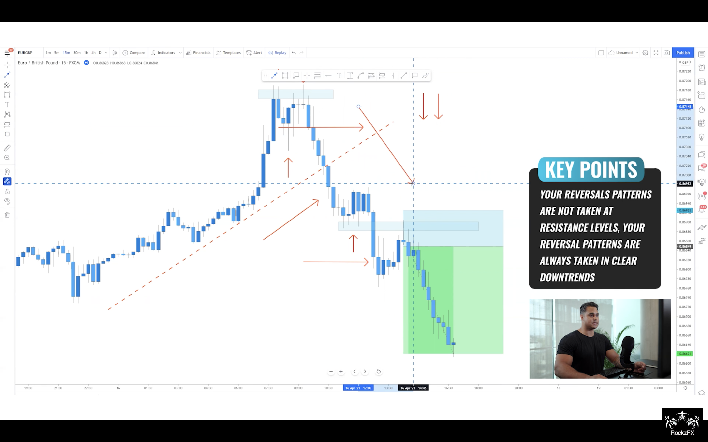
        
2. UpTrend
    1. Simple retest
        - classic break and retest in uptrend
        
        
    2. Deep pullback
        - Don't discount your buy bias just because simple retest isn't found
        
        
        
    3. Cheeseman
        - Again, fail to create **higher high** and respect previous **higher low**
        - `Note`: all you have to do is to watch closely if it's gonna break below **previous higher low** to revert the trend or respect for continuation
        - `Note`: momentum is really key to make a decision if you're riding on the continuation
        
        
        
        
    4. Reversal
        - `Note`: we're not looking for reversal but we stalker the trend with confluential evidence 
        
        
        
        
        

### Market Bahaviour 
`3. identify the trigger by candlestick bahaviour`

1. 3-candle Formation 
    

    1. Momentum candle
        - `Tip`: main entry signal
    2. Depletion candle
        - no one in control
    3. Rejection candle / Wick rejection
        - `Tip`: more often than not it's sign of reversal 
        - bullish rejection: bear controls first then bull comes later
        - bearish rejection: bull comes first then losing power to bear    
2. Momentum candle - Strength, Momentum, Volume and Control
    1. Strength 
        - 
    2. Usage
        - `Tip`: Always wait for pullback since any continuation requires exhaustion
        - `!!!`: Structure + Key Level + Momentum = your only indicator
        - 
        - 
3. Depletion candle - Weakness, indecision 
    1. No direction, no decision 
        - 
    2. Usage
        - 
    3. `Tip`: more often than not price will continue in the direction that broke the range. So always mark range bound (high and low) to frame the price and anticipate the dominating control after range broken
    
    4. `Tip`: never more often than not price will continue in the direction that broke the range 
    5. `Note`: link all behaviour along especially what will be shown around key levels

4. Rejection candle- Weakness, failure, continuation/reversal
    1. price is really stimulus and it's about to reverse or resume
        - bullish rejection (wick @ bottom): while downtrend, bull tries very hard to push back the bear
        - bearish rejection (wick @ top): in uptrend, bear scorns the bull
        - 
    2. Usage
        - 
            - 1st bearish rejection in an uptrend means nothing since no level is formed yet. Only trending higher high and higher are shown. 
            - next bearish rejection means something (no decision yet). if momentum seems depleting, then reversal might be awaiting.
                - `Tip`: we dont trade reversal so do jumb right in. 
        - 
            - it's confluencing of wick rejection on bearish body
            - `Tip`: be careful! In this bullish reversal, you need **new level** to be developed to prove that bull is really in control now by breaking the 1st higher high and retest it for continuing in reversed trend. Otherwise, it is just a cheeseman (still bearish) 
        - 
            - 1st evidence, we see bullish rejection in the downtrend 
            - 2nd evidence, we don't see lower low in the downtrend, but **higher low** instead
            - 3rd evidence, we see bullish rejection at **higher low**
            - 4th evidence, we see price breaks the **recent high** with momentum candle
            - 5th evidence, we see price retests the **recent high**
            - 5 confluences confirm reversal 

### Time and Place
1. trading time = london open 7-9a UK time, new york open 12a-2p UK time
2. trading pair = GBPUSD, EURUSD, USDCHF, EURJPY

---
[Back to Agenda](#agenda)
# Master Class 1.0
`Keep it simple`

> Only Analyze clear and current Trend, and Enter with proven Momentum with valid Risk management

1. Market Phase
2. Candlestick and Indicator
    1. Candlestick
    2. Indicator
    - SMA200 - direction
    - EMA50 - mean value (forex comforts mean value)
    - EMA14 - immediate movement

3. MST KISS - Pattern and Process 
    3.1 Price level
        - Structure High/Low
        - Recent level
        - Retesting level
        - Breaking out level
        - Strong level = v-shape bcoz big order is there

4. Break and Retest 
5. Trading Rules
    1. **2 Repairs max**.
    2. News = mostly be market correction = avoid or manage/exit position 
    3. Sunday/Monday = mostly be market correction = manage position
    4. Trade time: 5-10p (especially 730p)
    5. **Manage position**
        1. When price approach BE, close 50% and shift SL for free trade
        2. Stop order: to wait for price to get back in the zone 
            1. Entry with price in the middle of SL zone - manipulate range we bet
            2. Stop order entry = close +/- absolute(SL - close)
    6. Criteria
        - Keep it Simple Always
        - Enter only with Momentum - wick rejection, level down 
        - Pattern must be recognised
        - Buy when
            - Trending up
            - Reversing up
            - **HL** ( doesn’t have to be perfect )
                - If price is in buy market + doesn’t break h4 structure lows, wait for retest
                - anticipate rejection as potential signal 
                - Enter with valid SL and RRR
        - Sell when
            - Trending down
            - Reversing down  
            - **LH**
                - If pricing in sell market + doesn’t break h4 structure lows, wait for retest
                - anticipate rejection as potential signal 
                - Enter with valid SL and RRR
        - Range to next zone must be greater than 1:2 to accommodate 1:2RR
        - SL area must not be in the area where potential pullback might take place 
        - Wait until price come into SL area before triggering a trade 
        - Wait at least 1 x h4 (or 1 x h1) close at key level to proceed
        - Wait at least 2 x h1 rejection at key level to confirm price has attempted to break but failed 
        - No trade if you can’t recognise pattern or things don’t fit our criteria 
        - Trading time = 10-2 o’clock GMT (4 hr a day) ~ 5-8p TH time
        - Focus = 30hr before NY open 
        - Pull away from chart = 4 o’clock GMT ( London close )


6. Trading Plan 
`Clear Trend + Proven Momentum + Risk Management`

    1.  Clear and Current **Trend**  — H4
        - Trending/Cont. Pattern (Pattern + Direction = opportunity)
            - HH+HL / LL+LH with break-and-retest (previous level or trend line)
            - HH+HL / LL+LH with break and 50% pullback
            - HH+HL (uptrend) with break-and-fail-to-retest-but-form-Double Bottom (accumulation) —> no new structure just drop
            - LL+LH (downtrend) with break-and-fail-to-retest-but-form-Double Top (distribution) —> no new structure just drop
            - (Ranging) Break-out-Break-Back-in, retest, then continue 
                - Consolidation = no decision
            - Reversal sign: Never anticipate a reversal !
                - Break trend line + form new structure + retest with success pattern
                    - (Downtrend to uptrend): HH+HL —> double bottom
                    - (Uptrend to downtrend): LH+LH —> double top
                - Break trend line + form new structure + retest with failed pattern
                    - (Downtrend to uptrend): HH+HL —> HL
                    - (Uptrend to downtrend): LH+LH —> LH
        - Pattern
            1. Simple trending 
                1. Direction
                    1. Uptrend: buy at HL: if it doesn’t break h4 low, wait for retest and rejection before buy
                    2. Downtrend: sell at LH: if it doesn’t break h4 high, wait for retest and rejection before sell
                2. Formation
                    1. pullback and momentum push = HL/HH or LH/LL
                    2. Pullback and failed push (double top/bottom) = HL/lower High or LH/higher Low
            2. Break structure, wait for retest
            3. Break trendline, wait for retest 
            4. Double top/bottom, wait for momentum or broken structure  
            5. Missed Double top/bottom, wait for momentum or broken structure
            6. V-shape by engulf first, then wait for retest with coming pinbar or double top/bottom
            7. Consolidation: wait for break structure and retest 
            8. Double top/Trending market + Breakout, wait for  break back in + retest: Sell stop
            9. Break-out-Break-backin on H4 only
            10. Double top/bottom on H1/H4 only
        - Current
            - Right to left charting. 
            - When new structure is found, neglect the past and never expect trend resuming because it was reversed
                - Otherwise, anticipate cont. pattern for trend resuming 
        - Confirmation of failing to break
            - (Conservative) H4 close >= 1 candle at key level
            - (Intraday-like) H1 close >= 2 candles at key level
        - Analysis (Question)
            - What is direction bias?
            - Would I buy or sell?
            - Is this push or pullback phase?

    2.  Proven **Momentum** — H1/M30 + M15/M5
        - Scenario
            - Early(aggressive): 2 x wick rejections at major price level
                - Wick rejection = directional bias
            - Proven(conservative): Price must violate structure completely 
                - momentum shift (H1-higher timeframe) = break and retest (M15-lower timeframe)
        - Enter only on pullback
        - Wait for retest 
            - Never be the 1st to get in
            - Let it prove 

    3.  Valid **Risk** —  enough room
        - possible BE — 1R 
            - BE zone’s size = SL zone’s size
        - Possible TP — 3R
            - Range to next zone/level > 2R
            - No let profit run but close all at 3R
        - Hedging SL — 1R
            - SL = Protective zone = Capital shield 
                - Price must be in the middle of SL zone
                - SL mustn’t be in the area that pullback might take place
                - SL must cover significant level (prevent whipsaw and trap)
            - Valid SL can cause BE 
            - SL amount 
                - Agressive: 5pip 
                - Conservative: 10pip

>  H4 —> H1 —> M15
>  H4 (Bias), H1/M15 (Pattern + Behaviour)

7. Step 
    1. Pick pivoting level on W1 
    2. Notify movement on D1
    3. Analyse trend — H4
    4. Analyse price structure on H4
    5. Analyse behaviour when price approaching key levels — H1/M30
    6. Anticipate at — M15
        1. 1st rejection at key level to spot momentum 
        2. 2nd rejection at key level to manage position with rules and conditions
    7. Journalize 

---
[Back to Agenda](#agenda)
# Master Class 2.0 Part 1
`Part 1: Multiple timeframe mastery`

### Quick Recap
[Pattern Review](#pattern-and-process-mastermind)


### Applying Strategy
[/] structure low/high have been broken 
    - if structure low/high havn't, then it's probably `consolidating` or `double top/bottom`
    - [/] price has broken high/low
[/] clearly left the structure
[/] buy/sell after an `exhaustion phase`
    - identify strong exhaustion like 50%, 60%, etc.
    - [/] clearly exhausting
    - trade with the trend
[/] 1 x `4H` candle `close with a wick` bcoz it creates `level` for you
    - identify prospecting wick that can create level for us
    - [/] 4H wick rejection indicating potential HL/LH
[/] Momentum shift creating HL/LH

### What to be avoid in `4H`!
1. trade in push phase - winning opportunity is depleting
2. trade too close to high/low - we can't create 3RR but we get negative RR instead when there is no room 
3. trade breakout - it could break out and break back in
4. trade while price is coming back to the level > 2 times

### Thought Process
1. Thought Process
    [/] Is structure clear and can I identify if it is up or down?
    [/] What phase is the market in? 
        - stay away from `push phase`
        - wait for wicks when in `exhausion phase`
    [/] Do I see any issue if I take the trade? 
    [/] Do I have enough range?
    [/] Stay out! if I feel I am late
    [/] Trade it! if I feel it is a trade
2. Sample Thought Process


3. Pattern
    1. No.1
    2. Market phases [link](#market-structure)
    3. understanding candlestick patterns [link](#market-bahaviour)
    
### Momentum Shift Trading
1. Brief
    1. Motto: it's not basic but advanced level of trading requiring you to understand 
        1. `basic`
        2. `patterns`
        3. `entries`
    2. `Idea` 
        1. `4H` plan the game; what particular strategical edge you're playing
        `Remember` trade the trend.
        `Remember` ranging has a trend only if it shows breakout

        2. `4H` see **1 wick rejection** followed by momentum shift candle
        3. `4H` `1H` mark and wait for 50% (30-60%) retracement of momentum shift candle 
        `Remember` pullback too deep without closing higher/lower (around the same OHCL) may be too strong/risky to count as pullback after momentum shift bar. Momentum shift bar usualy changes level OHCL so we mostly see price falling down or pushing up in ladder step
           |   ||       
          |     |
         |       |
        ||        |

        4. `15M` wait for below pattern triggered before making an entry
            1. **1 or 2 clear wick rejections** to form HH/HL or LL/LH
            2. **double top/bottom** 
        `Remember` visual is a must because no pattern is always created precisely

        5. `15M` manage risk, take BE and let profit run
        `Remember` no perfection exists, but it needs to make sense (highly probable)


        [/] take advantage of `1 x 4H` candle
        [/] identify continuation bullish/bearish
        [/] getting in and out with in shortest time
        [/] smaller `SL`, smaller `TP`
    3. Benefit: less time consuming based on the same discipline and risk management
        - ex. same 2% risk investing on smaller SL like 3pips allows you take larger lot size
    4. Sample
    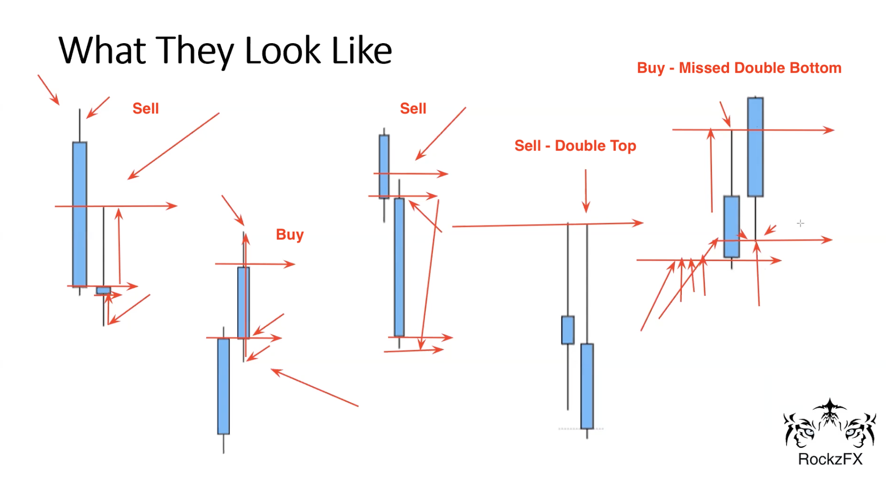

2. Identify `Momentum Shift Trading` opportunity
    1. 4H wick rejection continuation --> analyze in `4H` 
        1. How does it look like?
        It is basically a nice wick rejection followed by a momentum candle spotted in `4H`. Then, we mark potential retracement in lower timeframe `1H` respecting that momentum candle anticipating the pattern for making an entry along with the trend 
        

        2. Formation
            1. immediate formation
                1. strong rejection
                2. pressure 
                3. retracement
            2. deferred formation
                1. breakout 
                2. break back in
                3. rejection 
                4. pressure
                5. retracement
        3. Sample 1: bearish to bullish

        `Step 1`: `4H` Identify strategy - what game we're about to play
        

        `Step 2-3`: `4H` Wait until we can identify structure
        
        
        
        `Step 4-6`: wait for momentum shift, then zoom into lower timeframe (`15M`,`30M`,`1H`) to spot clear patterns
        
        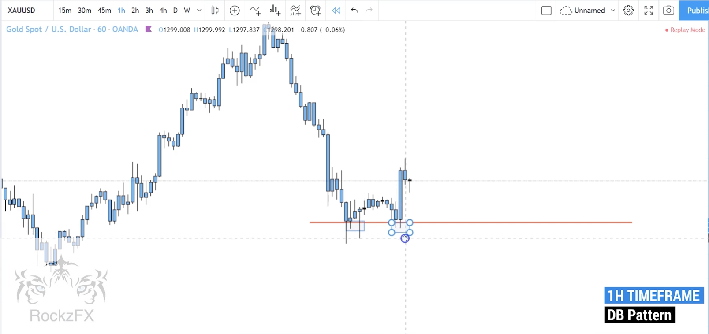
        
        
        `Step 7`: switch to `15M` (entry timeframe) to find the opportunity
        
        
        `Step 8`: take the trade in `15M` with `Stop Order` 
        `Note` make sure price is placed in the middle of SL 
        
        
        `Step 9-10`: take BE, and let profit run
        
        
        
        `Step 11`: zoom out to see momentum shift with 50% retracement shown in `4H`
        

        4. Sample 2: bearish to bullish

        `Step 0`: know the game and select how to play!
        - this is downtrend where we anticipate to follow to down side with wick rejection
            - [/] plan 1: aggressive entry with momentum --> we play this game
            - [x] plan 2: wait for break and retest previous low before entry

        `Step 1`: `4H` Spot wick rejection
        

        `Step 2`: `4H` draw level around that wick 
        

        `Step 3`: `4H` wait for momentum shift afterwards
        `Remember`: momentum candle must be 1 big of 4H close 
        

        `Step 4`: `1H` draw potential retracement of that momentum candle in lower timeframe 
        

        `Step 5`: `15M` wait for pullback
        `Remember`: we don't trade push phase
        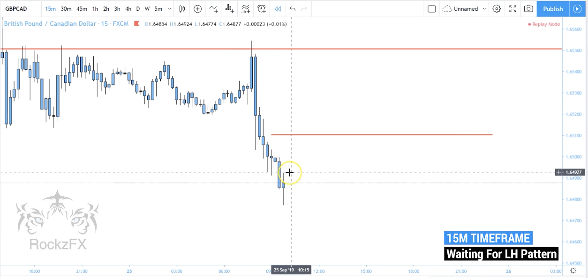

        `Step 6`: `15M` adjust level accordingly
        `Remember`: never expect perfection 
        

        `Step 7-8`: `15M` take the trade with **Sell Stop** by placing current pricing at the middle of SL range
        
        

        `Step 9-10`: `15M` take BE and let profit run
        
        

        `Step 11-12`: zoom out to see momentum shift with 30% retracement shown in `4H`
        
        

        5. Sample 3: bearish to bullish

        `Step 0`: know the game and select how to play!
        - this is downtrend where we anticipate to follow to down side as we see wick rejection forming lower low, then we need to see lower high 
            - [/] plan 1: aggressive entry by waiting lower high being formed and enter with momentum --> we play this game
            - [x] plan 2: wait for break and retest previous low before entry
        
        `Step 1`: `4H` Spot wick rejection forming lower low
        

        `Step 2-3`: `4H` Spot wick rejection forming lower high
        
        

        `Step 4`: `4H` waiting for momentum 
        

        `Step 5-7`: `1H` mark potential 50% retracement
        
        
        

        `Step 8`: `15M` scale down to see direction shift from bullish to bearish pressure
        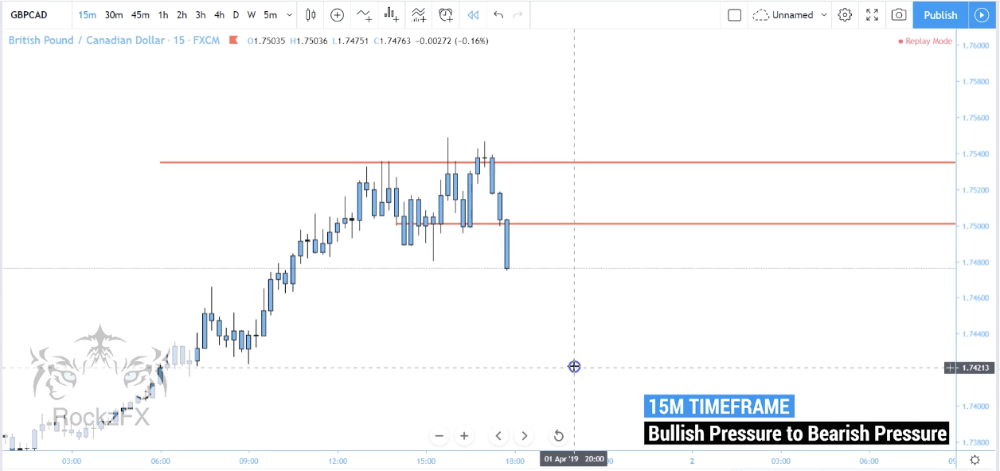

        `Step 9`: `15M` wait for exhausion before resuming to the downside
        `Remember`: we don't trade push phase
        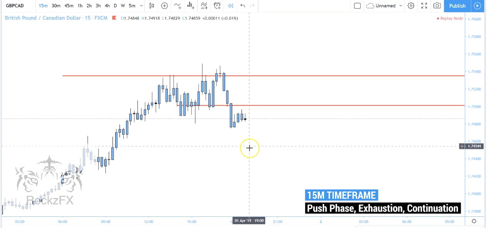

        `Step 10-12`: `15M` manage the trade
        `Remember`: 1:3RR always
        `Remember`: pricing in the middle of SL range
        `Remember`: stop order only
        `Remember`: let profit run
        
        
        

        `Step 13`: `4H` zoom out to see 50% retracement
        `Note`: enough room for pricing moving before reaching lower low
        

    2. Breakout 50% retracement `***`
        `Note` 50% retracement after momentum bar will be mainly used with other patterns 

        1. How does it look like
        Spotting the `consolidation` market got broken may lead to either 
        - (1) immediate - can make entry right away. We can find easy SL & TP. Thus, this pounces for TP.
            - when zooming into lower timeframe: pattern = **higher low/lower high**
        - (2) not immediate - need to wait for nice formation before moving forward. There is usually no enough room for TP to satisfy 1:3RR, so this takes time
            - when zooming into lower timeframe: pettern = **double top/bottom**
            - `Note` we need another `4H` to develop the formation
        So, basically, it may or may not give you enough room to take profit after breaking structure. Typically, we ain't sure if it's gonna break the structure or not. Then, we'd better zoom into `15M` to find nice and clear structure.
        
        

        > `Remember` 
        > 2 wicks rejection for `15M`
        > 1 wick rejection for `4H`

        2. Formation
            1. Immediate - HH/HL or LL/LH in `15M`
            2. Not immediate - Double top/bottom in `15M`
        3. Sample 1

        `Step 1-3`: `4H` mark high and low of the range, and wait for clear momentum
        `Remember` Always check your range
        
        
        
        

        `Step 4-7`: `4H` mark potential retracement like 50% of momentum bar, and wait for clear break out of the range. Scale down to `1H` to cross check potential turning point before driving out of the range.
        
        `Remember` Always wait for clear break 
        
        
        
        
        
        `Step 8-9`: `4H` mark potential retracement (50%) of breakout bar.
        
        


        `Step 10-11`: `15M` wait for retracement coming to the point we marked (50% retracement)
        `Remember` Always visualize your findings on the chart. You need to see it as clear visualization.

        
        

        `Step 12-15`: `15M` take the trade and go BE
        `Remember` price's always in the middel of SL range
        `Remember` it doesn't have to retrace 50%; it could be more or less. **Adjust yourself to what market is being**

        
        
        
        

        4. Sample 2

        `Step 1-2`: `4H` come up with the strategy based on dominant direction
        `Remember` Always with the trend
        
        
        

        `Step 3-5`: `4H` mark the range, and wait for momentum bar breaking out the range
        
        
        
        

        `Step 6`: `4H` mark 50% retracement
        

        `Step 7`: `15M` wait for retracement at given level (50% retracement of momentum shift bar)
        

        `Step 8-12`: `15M` take the trade when market comes to your edge
        `Remember` everything doesn't have to be perfect, but need to make sense

        
        
        
        
        

        4. Sample 3

        `Step 1`: `4H` come up with the strategy always. Failing to break may need another exhaustion to be able to break above or below
            

        `Step 2-3`: `4H` mark high & low, and wait for momentum shift breaking out
            
            

        `Step 4-7`: `4H` `1H` analyze momentum shift bar, mark 50% retracement, and wait for price retracing back to that level
        `Remember` good pullback must not be too strong like double top/bottom, but HH/HL or LL/LH

            
            
            
            


        `Step 8-10`: `15M` spot pattern/evidence which is in this case double top
            
            
          

        `Step 11-14`: `15M` take the trade, go BE and realize breakout with double top 50% retracement
              
              
              
        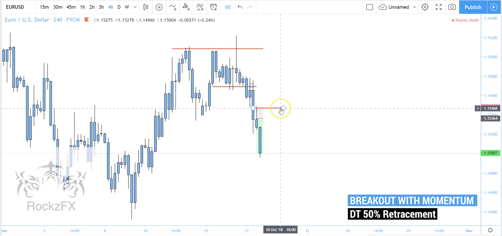      

    3. Over-extended continuation
        1. How does it look like

        The idea is to spot `extreme push in the market`, and believe that there will be `exhaustion` after the great push. Make an entry at the early pullback 
        `Patter` more often than not it is: push (wave 1) --> pull (wave 2) --> `extreme push (wave 3)` --> pull (entry)
        `Note` most of the time, we trade with the trend. This time, we take countertrend in short period of time
        

        2. Formation -- not really clear, so let's see sample
            1. Momentum shift 
            2. Clear exhausion 
        
        3. Sample 1

        `Step 1-3`: `4H` again, know the game and prepare your strategy         
        
        
        

        `Step 4-5`: `4H` discern over-extended push 
        
        

        `Step 6-7`: `4H` mark recent high at recent wick and anticipate exhaustion after great(over-extended) push
        
        

        `Step 8-9`: `1H` `15M` see behaviours
        
        

        `Step 10-11`: `15M` spot pattern that hides from your sight
        `Remember` not every pattern is easily spotted

        
        

        `Step 12-16`: `15M` take the trade, go BE, and let profit run
        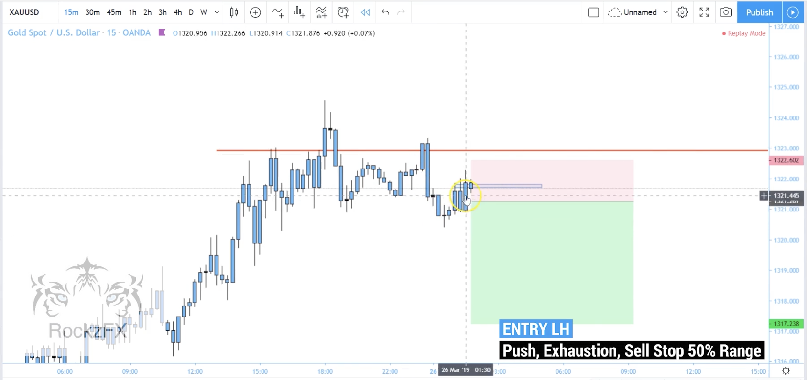
        
        
        
        
        
        3. Sample 2

        `Step 1-2`: `4H` again, know the game and prepare your strategy         
        
        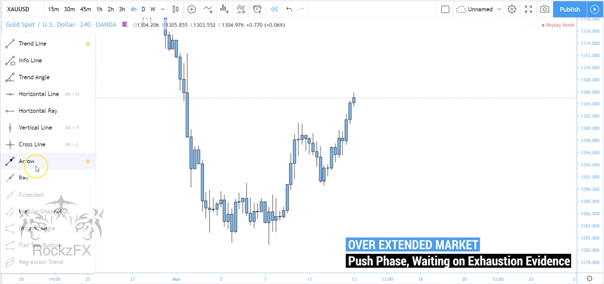

        `Step 3-4`: `4H` spot the wick rejection followed by momentum shift
        
        

        `Step 5-6`: `4H` mark 50% retracement, and `1H` observe behaviour
        
        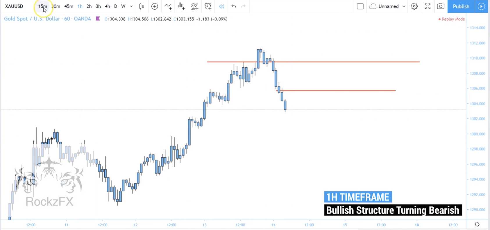

        `Step 7-8`: `15M` wait for pullback around that level
        `Remember` don't expect the perfect; it could be more or less than 50% retracement
        `Remember` it doesn't have to be only wick rejection; engulfing is another to spot

        
        
        
        `Step 9-13`: `15M` manage the trade, go BE, and profit run
        
        
        
        
        


        3. Sample 3

        `Step 1-2`: `4H` again, know the game and prepare your strategy         
        
        

        `Step 3-4`: `4H` spot potential stop (wick rejection,engulfing) as it is slow down, and wait for momentum shift bar
        
        

        `Step 5-6`: `4H` mark 50% retracement
        
        
        
        `Step 7-8`: `1H` observe patterns where in this case D.T. shown
        
        

        `Step 9`: `15M` observer behaviour. wait for price coming back for 2nd chance to make an entry        
        `Remember` 1st change to make an entry might pass; you can wait for second or disregard it.
        
        
        `Step 10-13`: `15M` manage the trade, go BE, and let profit run
        
        
        
        


    4. Double Top/Bottom continuation
        1. How does it look like
        
        `D.T/D.B` happens when it fails to break the structure for its continuation
        `Double Top`: fail to break the structure in bearish market, then it pulls back to previous high before continue
        `Double Buttom`: fail to break the structure in bullish market, then it pulls back to previous low before continue
        
        `Remember` we don't get in right after DT/DB formed bcoz we don't if that is a true rejection, so we need to wait momentum bar(momentum shift) comes in first

        

        There are fast and slow entry. If you get in early, you're highly likely to win as there is more room for price to move towards TP
        


        2. Formation 
            1. Momentum shift 
        
        3. Sample 1
        `Step 1-4`: `4H` again, visualize structure/pattern, and know the game to prepare your strategy        
        `Remember`: never expect LH without any confirmation since it could turn likewise

        
        
        
        

        `Step 5-8`: `4H` use momentum shift in confluence to confirm pattern being used. 
        `Remember` from **possibility** to **probability** not **perfection**
        
        
        
        
        

        `Step 9`: `4H` mark 50% retracement        
        

        `Step 10-11`: `15M` spot the shown pattern giving us an edge based on 50% pullback level marked
        
        

        `Step 12-15`: `15M` manage the trade, go BE, and let it flow
        
        
        
        

        `Step 16`: `4H` it is initially fail to break the low (turnaround), then it gets strengthen by D.B. with momentum bar before resuming its trend
        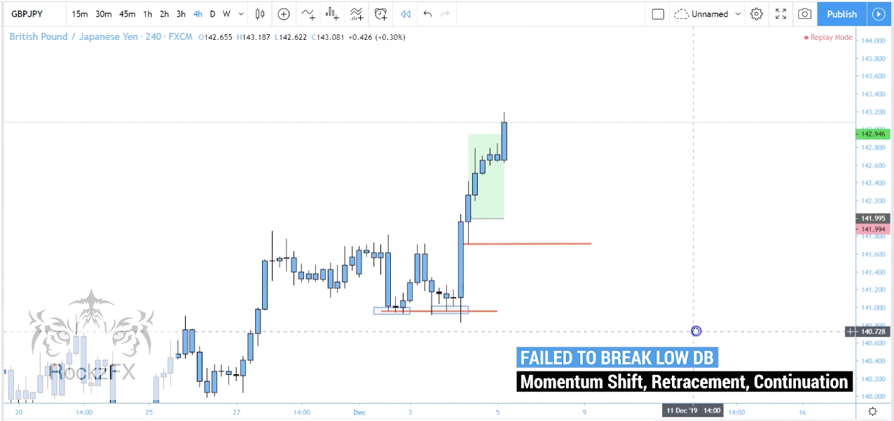

        4. Sample 2

        `Step 1-6`: `4H` Again, know the game (listen to what God is telling you about the market) to plan your trade. 
        `Remember` Wait until you can clearly see.
        `Note` always mark the range when you barely see the direction
        `Tip` mark confluential wicks instead of highs. adjust accordingly to fit what market reveals to you at the moment

        
        
        
        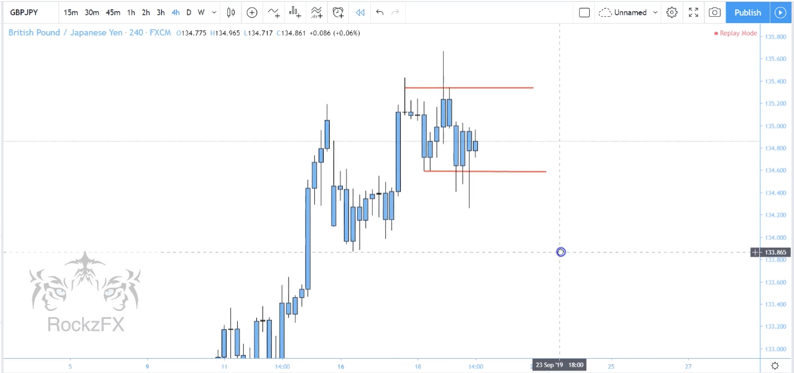
        
        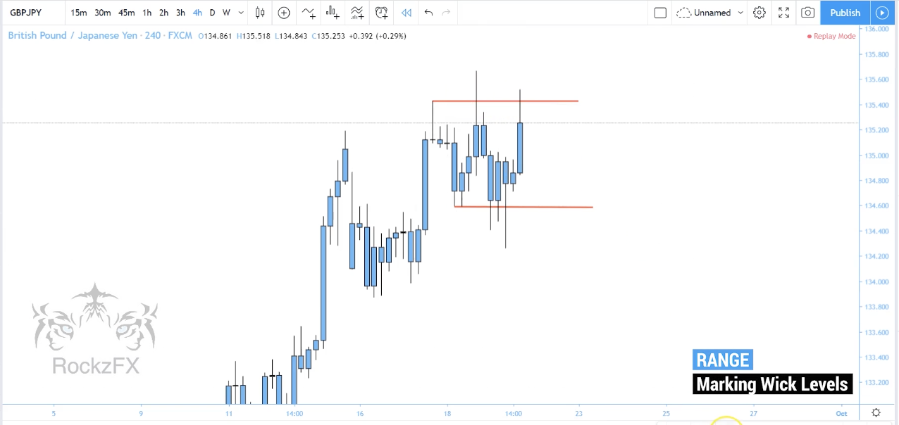

        `Step 7`: `4H` wait patiently to see particular behaviour at the level we marked
        

        `Step 8`: `4H` adjust level accordingly to fit your strategy. In this case, we need clearer break, so we shift level up. 
        `Remember` Even nothing is perfect, but you need to be faithful to your strategy. If market doesn't give you a favour, just stay out.

        


        `Step 9`: `4H` respect the market if it denies your expectation. 
        `Remember` Don't expect, just react to what market is being revelaed. We play on the **game of possibility and probability**

        

        `Step 10`: `4H` mark 50% retracement
        

        `Step 11`: `1H` see behaviour/pattern at level we marked in lower timeframe
        `Remember` don't forget to take a look `1H` `30M`
        

        `Step 12-13`: `15M` map revealing behaviour/pattern onto our strategy, in which this case is D.T, to see if we can get our edge. Now, wait for lower high to be formed before moving forward
        
        

        `Step 14`: `15M` wick rejection shown to confirm lower high
        

        `Step 15-17`: `15M` manage trade, go BE, and let it fly
        
        
        

        `Step 18`: `4H` trade in the range (micro swing trade). It is initially fail to break above/below and go ranging. Importantly, we see wick rejecting high of the range, then we anticipate to scalp on probability to the downside (structure low) based on 50% retracement anticipation
        `Remember` we don't trade ranging much except there is an obvious opportunity for us to get in. 

        

        5. Sample 3
        `Step 1-4`: `4H` Super importantly, know the game. sit awaiting if you can't clearly see the market's movement
        `Remember` mark range if you can't come up with anything, and observe the behaviour

        
        
        
        


        `Step 5-7`: `4H` momentum comes in followed by its countering `breakout and break back in`. Visualize the pattern; now we see highly likely of D.T. formed

        
        
        

        `Step 8-9`: `1H` mark D.T
        
        

        `Step 10-11`: `4H` realize D.T, and mark 50% retracement
        
        

        `Step 12`: `15M` see momentum shift
        

        `Step 13-15`: `15M` anticipate patterns either wick rejection or DT/DB
        
        
        


        `Step 16-18`: `15M` manage the trade, go BE, and let it fly
        
        
        

        `Step 19`: `4H` 50% pullback entry based on D.T to the downside
        

    5. Fail to break above/below
        1. How does it look like

        price can't break the structure to continue further on the dominant direction, so anticipate market tunraround
        

        2. Sample 1
        
        `Step 1-3`: `4H` visualize the market, and ask your intuitiveness what strategy you may draw on the current market
        `Remember` draw the structure high and low
        `Note` minor level is sometimes also important

        
        
        


        `Step 4-6`: `4H` spot fail-to-break pattern to anticipate following momentum shift other way around
        
        
        

        `Step 7`: `4H` mark 50%(potential) retracement 
        

        `Step 8`: `1H` get clearer visualization
        

        `Step 9-12`: `15M` anticipate pullback drawn to marked level + momentum shift to downside
        `Remember` formulating pattern could be wick rejection or DT/DB

        
        
        
        

        `Step 13-14`: `15M` manage trade, go BE, and let it fly
        
        

        `Step 15`: `4H` fail-to-break then break below
        

        3. Sample 2
        
        `Step 1-2`: `4H` always respect market movement; never anticipate! Clearly, we see rejection and momentum shift to make price fail to break above.  
        
        
        


        `Step 3`: `4H` mark high and wait to see if the line gets broken
        

        `Step 4-5`: `4H` it gets accumulated for an attempt to break above by forming LH. However, it finally rejects LH level by wick rejection
        
            

        `Step 6-7`: `4H` more evidence is confirmed by `break-in and break-out`. Mark retracement level (50%)
        
         

        `Step 8-9`: `1H` zoom to get clearer picture where we see fail-to-break above and show DT formation
        
         

        `Step 10`: `15M` see behaviour
        
        
        `Step 11`: `15M` adjust potential retracement as we spot wicks respecting structure low in 15M
        
        
        `Step 12`: `15M` wick tells us that it can't push higher or break above this level
        

        `Step 13-14`: `15M` probability of wick rejection or DT/DB in which this case is DT
        
        


        `Step 15-16`: `15M` manage the trade, go BE, and let it flow
        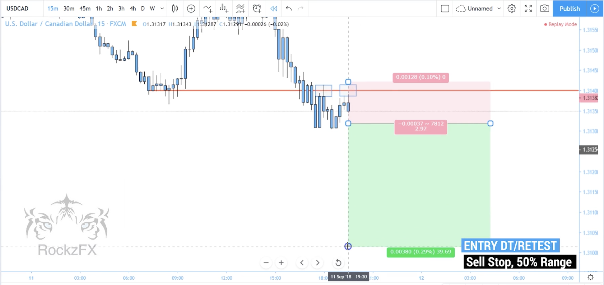
        

        `Step 17`: `4H` it fails to break above, then we anticipate the early entry with DT.
        


        4. Sample 3

        `Step 1-2`: `4H` always respect market movement; never anticipate! Clearly, we see rejection to the downside. Mark structure low and observe behaviour
        
        
        

        `Step 3`: `4H` momentum bar comes in to the upside convincing the market turnaround
        

        `Step 4`: `4H` mark retracement level (50%)
        

        `Step 5`: `1H` see clearer momentum 
        

        `Step 6-8`: `15M` wait to rejection around level that we marked recently
        
        
        

        `Step 9-11`: `15M` manage trade, go BE, and think about re-entry if needed or possible
        
        
        

        `Step 12-15`: `15M` re-entry with evidence which is, in this case, DB. manage trade, go BE, and let it fly
        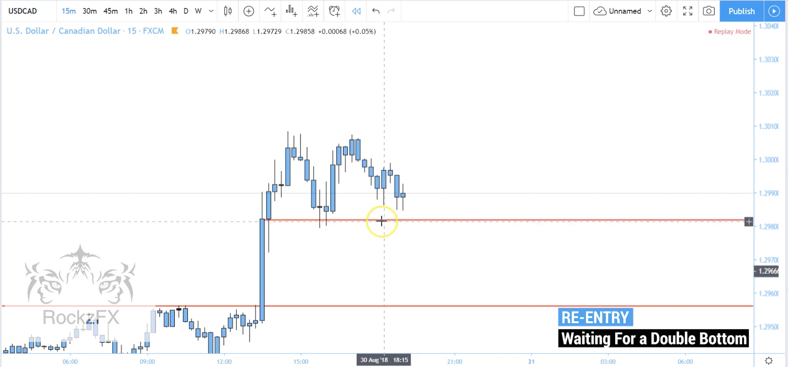
        
        
        

        `Step 16`: `4H` it is fail-to-break followed by momentum shift with entry twice.
        
        
3. Pattern in detail 
    1. [`4H`] - Pattern: these patterns are developed with in `1 x 4H after momentum shift`
        1. formations
            `Remember` identify below patterns is extremely hard but it's crucial
            1. double top/bottom
            2. lower high (LH)
            3. higher low (HL)
            4. perfect break and retest
            

        2. what does pattern infer?
            1. 1 x 4H bar = 16 x 15M
            2. wick indicates pressure in the market. It is needed to create a tradable structure
            `Remember` Structure is formed everyday, but it is just hided from your sight

        3. Example
        
        `Example 1` wick followed by momentum shift retracing at 50% pullback in form of LH
        

        `Example 2` LH followed by LL
        

        `Example 3` Double Top (DT)
        

        `Example 4` Break-out and Break-back-in followed by LH
        

    2. [`15M`] - Pattern's being formed variation in `15M` only
        1. Clean pattern
        

        2. Messy pattern
        Price lost its momentum to push up, so it now can go either up or down 
        `Remember` as long as you back your analysis with clear mind of dominant direction and structure, it is good to go even it is hard to visualize the pattern. 
        `Remember` take the trade **only when you have clear mind** of what you're risking
        

        3. Fast reacting
        Basically, price significantly reacts to respecting level by shown great momentum shift after respecting 
        

        4. Slow reacting 
        Solely analyze in `15M` could lead you to massive destruction as below
        

        Instead, we do MTFA, and follow direction and structure of `4H`
        `Remember` KIDS - `K`eep `I`t `D`amn `S`imple
        

        5. Break and retest
        Simple break and retest is also commonly found in `15M`
        
        

    3. How many pattern do I need?
    `Answer` 2-3 patterns
    `Remember` learning is easy; master at it (to make it profitable/your edge) is hard and waste time 
    `Tip` stop hopping like grasshopper, and tie with knot with a few systems you believe. Learn hard, rehearse hard, test hard, work hard, earn abundantly

    4. What pattern Rockzfx trade?
        `Answer` 
        1. 4H wick rejection continuation, 
        2. Breakout 50% retracement
        3. Over-extended continuation
        4. LH after Double Top or HL after Double Bottom - slow entry 
        `Note` entry with double top = fast entry

4. Summary
> factor everything you leaned altogether 
> structure + direction + pattern + behaviour + enough range to fit in 3RR

---
[Back to Agenda](#agenda)
# Master Class 2.0 Part 2
`Part 2: Entries mastery`


### 4H Wick Rejection
``` Recall
1. find wick rejection followed by momentum shift bar
2. xx
```
Example
[4H wick rejection continuation example](4h-wick-rejection-continuation-ex1.png)
[4H wick rejection continuation example](4h-wick-rejection-continuation-ex2.png)
[4H wick rejection continuation example](4h-wick-rejection-continuation-ex3.png)

### Breakout 50 percent retracement
``` Recall
1. find wick rejection followed by momentum shift bar
2. xx
```
Example
[Breakout 50% retracement example](breakout-50%-retracement-ex1.png)
[Breakout 50% retracement example](breakout-50%-retracement-ex2.png)
[Breakout 50% retracement example](breakout-50%-retracement-ex3.png)

### Over-extended continuation
``` Recall
1. find wick rejection followed by momentum shift bar
2. xx
```
Example
[Over-extended continuation example](over-extended-continuation-ex1.png)
[Over-extended continuation example](over-extended-continuation-ex2.png)
[Over-extended continuation example](over-extended-continuation-ex3.png)

### Double Top or Bottom continuation
``` Recall
1. find wick rejection followed by momentum shift bar
2. xx
```
Example
[Double top/bottom continuation example](double-topbottom-continuation-ex1.png)
[Double top/bottom continuation example](double-topbottom-continuation-ex2.png)
[Double top/bottom continuation example](double-topbottom-continuation-ex3.png)

### Fail to break above or below
``` Recall
1. find wick rejection followed by momentum shift bar
2. xx
```
Example
[Fail to break above/below example](fail-to-break-abovebelow-ex1.png)
[Fail to break above/below example](fail-to-break-abovebelow-ex2.png)
[Fail to break above/below example](fail-to-break-abovebelow-ex3.png)


---
[Back to Agenda](#agenda)
# Master Class 3.0 
`Single timeframe mastery`

1. market structure (up/down/sideway)

---
[Back to Agenda](#agenda)
# Master Class 4.0
`Unrivalled 1M scalping`

### Theory and What to expect
1. `market always trends!` so go with market flow
2. there are tons of oppties every day
3. we can take advantage of `trends structure` then we can achieve good RR
4. it is possible to have good RR and risk management 
5. you'll be good to go if going with the `market flow`

### Data breakdown 
1. data collection
    1. observation
    2. %win from no BE rule
    3. %lose from winning position

### Key elements
1. market structure
2. normal pattern 
3. extra pattern
4. key level

### Time & Pair
1. xxx

---
[Back to Agenda](#agenda)
# Pattern and Process Mastermind

1. Structure
- practice by reading from time to time and decompose what structure is being formed without entry consideration. Like, watch movie and **realize sequence of stories**
- `Expectation`: Direction bias, level created, bahaviour including decision of sell or buy
- Challenge 1 


- Challenge 2: initially, price has been push higher and create double top


- Challenge 3 


2. Pattern
- practice by reading from time to time and spot what pattern is being formed 
without entry consideration. Like, watch movie and **spot easter egg**.
- `Expectation`: Pattern mapping
- Challenge 1 


- Challenge 2 


- Challenge 13
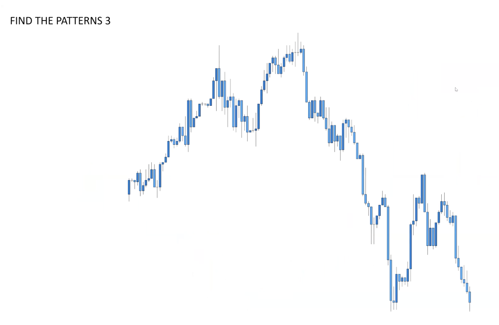


Example 1: Chesseman, BOBBI, BNR


Example 2:


Example 3:


**Plan**


### Craft plan

### Describe Behaviour

---
[Back to Agenda](#agenda)
# Tips {#tips}
1. During push phase, if it exhausts to somewhere in between, it is still in the game. But, if it pullbacks to the origin of previous phase, reassess the structure again coz it is liquidity correction where structure may be probably changed.
2. For retesting point, we disregard long wick’s area but accounting for small wick area.
3. For clear structure both ranging and trending, we can draw a trend line or box to do buy or sell respecting touch points 
4. Don’t enter with engulfing bcoz SL is too big
5. Try to stay with the current moment as much as possible; don’t collect information from the past at the very beginning.
6. Strong candle <> news inflicted candle
7. The lower timeframe, the more pure of the behavioural analysis which is no pattern involved 
8. Cheese man = double top/bottom of lower high/higher low 
9. FOMO fixed by waiting for retest aligning with H4 bias
10. Direction(h4) + Evidence(h1) + confirmation(h1) + behavioural (h1,m30,m15) + enough range (m15) ALWAYS
11. Price must retest the strong level before driving further
12. 10-15pip SL only
13. Close Breakeven as quickly as possible if things turn against 
    1. Move SL to BE
14. Trade 10AM - 3PM
15. Fix h4 level-of-analysis on lower timeframe 
16. H4 H1 m15
17. H4 - look for direction
18. H1/M30 - look for sign of rejection ex. Wick rejection 
19. Wick rejection not engulfing
    1. In case of engulfing found, there is coming wick rejection in form of pinbar. 
20. 5% a day , 15% a month
21. Preserve capital FIRST, proceed with procedure and process LATER
22. Momentum is the wick rejection in M30
23. It doesn’t matter h1, m30 or o15 because we expect the rejection at level not specific formation. So, enter as long as you can find SL area.
24. Take into account news and time
25. No perfect retest, observe their intention (momentum shift)
    1. Trade breakout (momentum shift) at NY Open  not London Open
26. Possible event
    1. Come back to retest
    2. Break retest level
    3. Fail to retest 
27. Secret
    1. Price statistically come back to retest major zones to form double top/bottom for liquidity 
28. Wider SL, more room to breath, longer TP to be hit.
29. Stop dealing with entry and secure your capital by focus on breakeven trade along the process
30. Market behaviour = presenting behaviour not the pass so when structure changes, anticipation and stop loss must be revised accordingly. When behaviour changes. Connect the dot to see clearer picture (clear level). Finally, it depends on my capital investing. The more capital, the wider SL I can endure

---
[Back to Agenda](#agenda)
# Challenge {#challenge}
`Practice —> Challenge —> Optimize —> Repeat`


### Task
- 100-trade challenges on major pairs + gold
- 200-trade challenges on major pairs + gold

Practice via 
- 1 month
- 3 months
- 6 months
- 12 months (1y)
- 24 months (2y)
- 48 months (4y) 
- 60 months (5y)
- 120 months (10y)


---
[Back to Agenda](#agenda)
# Daily Questions
1. what is `Direction`? 
2. Shall we `Sell or Buy`?
3. Is this `Push or pullback`?
4. What `pattern` shall we apply?
5. What `behavior or evidence` shall we need in confluence?
6. Do we wait for `momentum or rejection`?
7. Do we have enough room for `BE and TP`?

> I wanna see clear trend on H4 with the formation HH/HL or LH/LL to see if buyer or seller is in control. With the being said, I will mark out the recent high/low with the complete break and retest anticipation, and laddering levels from price distribution or level 2 data. Then, 2 things to confirm directional bias are behaviour at price levels in H1   and significant rejections in M15 


---
[Back to Agenda](#agenda)
# Keynote

### Trading Process
1. Use `w1` for pivoting
2. Use `d1` to identify movement
3. Use `h4` to identify key level and structure high/low and direction
4. Use `h1` 
    - to monitor behaviour of price approaching the key level 
    - to monitor price approaching the key level 
5. Use `m30` and `m15` to monitor 1st sign of rejection
6. Enter with `momentum`, `valid SL, BE and RRR`
    1. Momentum
        1. Price must violate structure completely 
        2. Momentum shift in higher timeframe = break and retest in lower timeframe
    2. Valid SL 
        1. Must not be in the area that pullback might take place
        2. Must be hold/against the significant level 
        3. It must be able to make BE
    3. Valid BE
        1. Size of BE zone = Size of SL zone
        2. Once price violate BE, shift SL in to make a trade breakeven
    4. Valid RRR
        1. Range to next zone > 1:2RR
        2. 1:3 RR
        3. 5SL —> 15TP or 10SL —> 30TP
7. Document and retrospect 

### Trading Perception
1. Momentum shift in higher timeframe = Break and retest in lower timeframe
2. Changing level, trendline, HH, LL = `Trend`
3. Wick rejection = `Direction Bias`
4. Pattern = `Opportunity`
5. SL zone = Capital Shield or `Protective Zone`
    1. Price must not be greater than `50%` of the protective zone
    2. Use `Buy/Sell Stop` to wait for price to get back in the zone
6. Consolidation = `No Decision`
7. Best plan = Simple Stupid plan that is highly disciplined
8. News = Major `Market Correction`; it's not really manipulation but adjustment at the moment
9. Sunday & Monday = Marjor `Market Correction`; Sunday correction impact so be aware. 


### Trading Rule 
1. Trend
    - always analyse the `current only`
    - only `clear direction` to be analyzed
2. Entry
    - only Pattern must be discovered
    - enter only on a pullback
    - enter at key level
    - Only with Direction bias
    - Only with Momentum
    - Only valude 1:1`BE`
    - Only valid 1:2-1:3`RR` 
        - 1:2 if SL is wide 
    - `Wait - Behavior Signal`
        - Wait price come into `SL zone` before triggering a trade with `STOP Order`
        
        > For `Stop Order`, try to make the entry **at the centre** as much as possible. Manipulate it in the range we bet. Ex. We know anticipating SL and current price (close). Then, stop order entry = current price (close) - (SL-current price (close)). The same range to make it at the centre

        - Wait at least `1 x h4/h1 close` at key level before proceeding = not to be the 1st one
        - Wait at least `2 x h1 rejection` at key level to confirm failing to break = not to be the 1st one
        - Enter only with `2 wick rejections` regardless of other patterns
    - `Wait - Structure`
        - Downtrend = LH+LL 
        - Uptrend = HH+HL
        - Downtrend-Double Top (DDT) = cheeseman
            - DB = reversal but we don’t take reversal 
        - Uptrend-Double Bottom (DDB) = cheeseman
            - DT = reversal but we don’t take reversal
3. SL
    - Always above key level
4. Take Profit
    - Always enough room to take profit and momentum 
5. BE
    - always partially close 50% at major level 
    - let another 50% left for letting it all run and hit TP
6. Mindset
    - Keep it Simple always
    - Never anticipate for a reversal (Never be the 1st to get in; let market prove itself)
    - Never forecast but react with processes
7. No trade 
8. Time
    - Time range= 5-8p-10p
    - Focus on 30min before NY Open = 7.30p
9. NEWS and Events
    - NEWS, manage position if I am in; otherwise, decide wisely if news can benefit the entry

### Indicator
1. SMA200 
    - direction
    - `XAUUSD` - `5M` : trade only above or below
2. `EMA50` - mean value. In forex, **price always approaches the mean value** which is more comfortable 
3. `EMA21`
4. EMA14 - immediate movement
5. `ATR` - volatility
6. `RSI` - momentum


### Trading Pattern 
1. Simple trending 
    1. Direction
        1. Uptrend: buy at HL: if it doesn’t break h4 low, wait for retest and rejection before buy
        2. Downtrend: sell at LH: if it doesn’t break h4 high, wait for retest and rejection before sell
    2. Formation
        1. pullback and momentum push = HL/HH or LH/LL
        2. Pullback and failed push (double top/bottom) = HL/lower High or LH/higher Low
2. Break structure, wait for retest
3. Break trendline, wait for retest 
4. Double top/bottom, wait for momentum or broken structure  
5. Missed Double top/bottom, wait for momentum or broken structure
6. V-shape by engulf first, wait for coming pinbar afterwards
7. Consolidation: wait for break structure and retest 
8. Double top/Trending market + Breakout, wait for  break back in + retest: Sell stop
9. Break-out-Break-backin on H4 only
10. Double top/bottom on H1/H4 only

### Chart Pattern
`Chart pattern forms strategy`

[More detail in bootcamp / chart pattern](#market-pattern)
1. Simple break and retest - `continuation`: break retest 1st level
2. Deep pullback - `continuation`: break and retest 2nd level
3. Cheeseman - `continuation`: not break and retest 2nd level
4. Reversal - `reversal`: not break but break 2nd level reversely  

### Entry Pattern 
1. 4H Wick Rejection
2. Breakout 50% retracement
3. Over-extended continuation
4. Bottom/Double Top continuation
5. Fail to break above/below


### Key Level
`No such perfect line` 
We need Only `Structure` since it's dynamic and responsive to current market sentiment

1. Structure Highs 
2. Structure Lows
3. `Strong Level`
    - `V-shape`: it signifies big orders there. Then, wait for double top/bottom at that level
    - `Bull/Bear trap`
    - `BOBBI`
    - `SL Hunt`
4. Broken trendline
5. `1W` Pivot

### Reading Value 
1. EURUSD = `4` floating points ex. 1.22096 - 1.22008 = 0.`0008`8 = 8.8 pips
2. USDJPY = `2` floating points ex. 104.614 - 104.462 = 0.`15`2 = 15.2 pips
3. Gold = `-2` floating points ex. 1284.12 - 1282.12 = 2`.`00 = 200 pips 

### Reading Chart
1. Always look from right to left
2. When new structure was formed in H4, we disregard the past. Especially, when we anticipate the double top/bottom, it won’t be validated anymore. Thus, when new structure was formed, we won’t expect the trend resuming but new reversal trending. However, if we cannot spot the new structure, we can still anticipate the resuming of the current trend.
3. Find bias in H4, then anticipate pattern and behaviour from H1 and M15 respectively.

### Processing H4-H1-M15 
1. Key takeaway
    1. It is more aggressive ( faster entrance )
    2. It closes BE more often
2. Pattern
    1. Pullback 50% then continue
    2. Breakout, break back-in, retest, then continue
3. Tips
    1. Confirm by 1 x H4 close 

### Processing H4-H1-M30 
1. Key takeaway
2. Pattern
    1. Break trend line and form double top/bottom
    2. Break structure and retest
    3. Break structure, fail to retest, then form double top/bottom
    4. Fail to break structure, form double top/bottom
3. Tips


---
[Back to Agenda](#agenda)
# Gold
`XAUUSD`

---
[Back to Agenda](#agenda)
# EURUSD

---
[Back to Agenda](#agenda)
# GBPUSD

---
[Back to Agenda](#agenda)
# USDJPY

---
[Back to Agenda](#agenda)
# EURJPY

---
[Back to Agenda](#agenda)
# USDCHF
